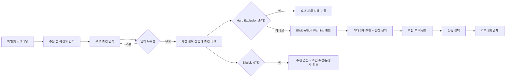
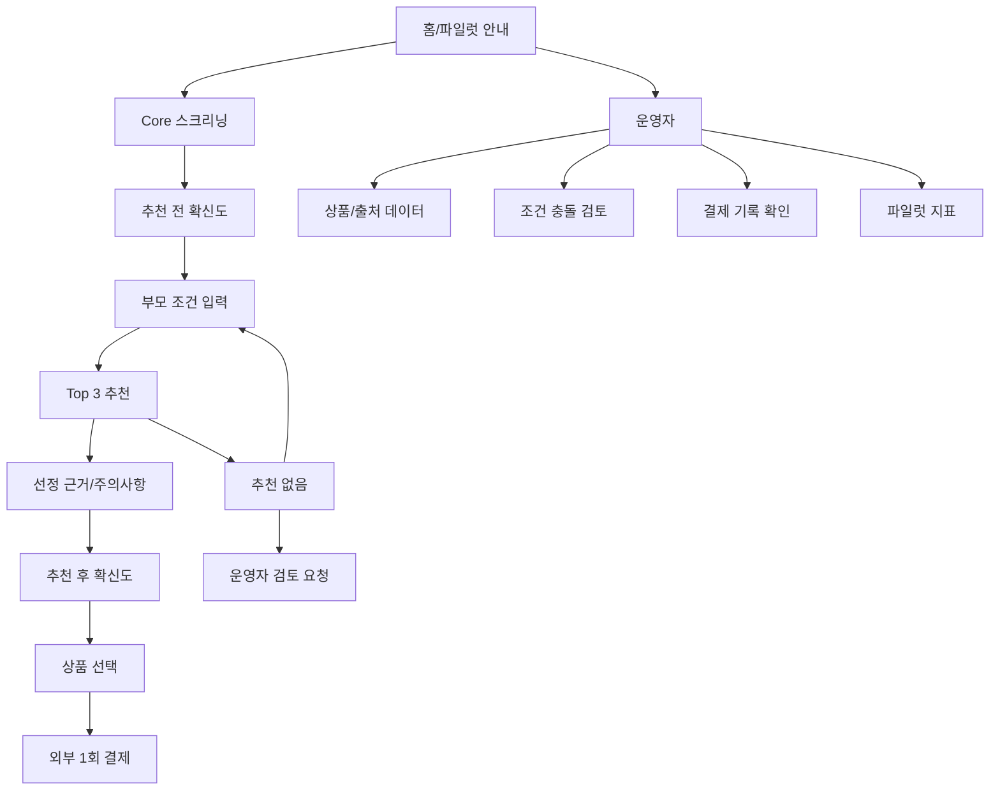

# 시니어스윗 저당식품 큐레이션 서비스 PRD v1.1

- **Document ID:** PRD-LOW-SUGAR-001
- **Owner:** Product & Operations
- **작성일:** 2026-09-11
- **개정일:** 2026-09-11
- **상태:** Approved for Implementation Baseline
- **제품명:** 시니어스윗(SeniorSweet, 가칭)
- **대상 플랫폼:** 모바일 우선 반응형 웹
- **요구 원천:** `김지수_20260801_3주차프로젝트.md`
- **하위 문서:** `02_SRS_BASELINE.md`, `PROJECT_SCOPE.md`, `03_UI_COVERAGE_ANALYSIS.md`, `04_UIUX_PLAN.md`

---

## 0. 문서 세트와 의사결정 계층

본 문서는 5종 구현 문서 세트의 최상위 제품 요구 원천이다. 문서 간 충돌 시 **PRD → SRS → PROJECT_SCOPE → UI Coverage → UI/UX Plan** 순서로 제품 의도를 해석하되, 실제 이번 빌드에서 구현할 범위는 `PROJECT_SCOPE.md`의 `IMPLEMENT/EXCLUDED` 분류를 따른다.

| 문서 | 책임 | 이 문서와의 관계 |
|---|---|---|
| `01_PRD.md` | 문제·사용자·가치·Story·AC·KPI·제품 경계 | SSOT |
| `02_SRS_BASELINE.md` | 시험 가능한 시스템·운영 요구사항 | PRD를 구현 요구로 변환 |
| `PROJECT_SCOPE.md` | 이번 MVP에서 실제 구현·축소·제외할 항목 | SRS 범위를 재분류하되 요구 자체를 삭제하지 않음 |
| `03_UI_COVERAGE_ANALYSIS.md` | 전체 요구사항의 UI/비UI 분류와 Screen 배치 | Scope 분류를 그대로 인용 |
| `04_UIUX_PLAN.md` | 5개 Screen의 레이아웃·컴포넌트·상태·접근성 | UI Coverage를 시각 설계로 구체화 |

> 시장성·가격 적합성·운영 확장성은 아직 검증 완료가 아니다. 구현 가능성과 시장 검증 완료를 같은 의미로 사용하지 않는다.

---

## 1. 개요·목표

### 1-1. 제품 한 줄 비전

> **당 관리가 필요한 부모에게 간식을 보내는 40~59세 직장인 자녀가, 부모 조건과 식품 표시정보를 연결한 제품별 선정 근거를 확인하고 최대 3개의 후보 중 5분 안에 확신을 가지고 1회 구매를 결정하도록 돕는 큐레이션 서비스.**

시니어스윗은 저당 상품을 많이 보여주는 쇼핑몰이 아니다. 핵심 가치는 **“왜 이 제품이 우리 부모에게 맞는가”를 설명하는 것**이며, MVP는 부모 조건 입력, 조건 충돌 검토, Top 3 추천과 선정 근거, 실제 1회 결제 행동 검증에 집중한다.

### 1-2. 문제 정의

Core 사용자는 따로 사는 65~79세 부모가 최근 혈당 또는 당 섭취 관리에 주의해야 한다는 말을 들은 40~59세 직장인 자녀이다. 부모에게 간식을 보내고 싶지만 성분표와 리뷰를 직접 비교할 시간이 부족하고, 정보를 확인해도 어떤 제품이 부모 조건과 맞는지 해석할 판단 기준이 부족하다.

| Pain ID | 문제 | 사용자 영향 | MVP 해결 방향 |
|---|---|---|---|
| **PAIN-01** | 식품 표시정보를 봐도 부모 조건에 맞는지 해석할 기준이 없다 | 구매 전 확신이 낮고 잘못 고를까 불안하다 | 부모 조건과 제품 표시정보를 직접 연결한 선정 근거 제공 |
| **PAIN-02** | 간식을 보낼 때마다 네이버·쿠팡·브랜드몰에서 검색·성분표·리뷰 비교를 반복한다 | 탐색 시간이 길고 피로가 누적된다 | 후보를 최대 3개로 제한해 비교 범위를 축소 |
| **PAIN-03** | 알레르기·제외 성분·먹기 어려운 식감 등 명백한 충돌을 사용자가 직접 검토해야 한다 | 부적합 제품 선택 위험과 책임 부담이 커진다 | Hard Exclusion 중심의 조건 충돌 검토 수행 |
| **PAIN-04** | 저당·무설탕 표시가 있어도 “우리 부모에게 왜 맞는지” 설명되지 않는다 | 기존 쇼핑몰과 광고성 정보에 대한 신뢰가 낮다 | 출처·검토일·조건 연결을 포함한 선정 이유 제공 |
| **PAIN-05** | “살 것 같다”는 의견과 실제 지불 행동 사이의 차이가 크다 | 사업성이 과대평가될 수 있다 | 59,000원 1회 실제 결제 또는 동등한 실결제 행동으로 수요 검증 |

### 1-3. 제품 목표

| 목표 ID | 목표 | MVP 목표값 | 측정 시점 |
|---|---|---:|---|
| **GOAL-01** | 제품 선택 시간을 단축한다 | 중앙값 **5분 이내**, 75백분위 **8분 이내** | 부모 조건 입력 시작 ~ 최종 상품 선택 |
| **GOAL-02** | 구매 전 판단 확신을 높인다 | 추천 후 평균 **4.0/5 이상**, 추천 전 대비 **+1.0점 이상** | 추천 근거 확인 직후 |
| **GOAL-03** | 실제 1회 지불 의사를 검증한다 | 추천 확인 후 24시간 이내 **59,000원 결제 전환율 20% 이상 가설** | 결제 완료 확인 |
| **GOAL-04** | 확인된 조건 충돌 상품의 발송을 방지한다 | 확인된 충돌 상품 발송 **0건 목표** | 주문 확정 전 |
| **GOAL-05** | 수동 검토의 운영 가능성을 검증한다 | 검토 시간 중앙값 **7분 이하**, P90 **10분 이하** | 운영 검토 완료 시 |
| **GOAL-06** | 초기 상품군의 추천 커버리지를 확인한다 | 대표 프로필 80% 이상에서 후보 1개 이상, 60% 이상에서 후보 3개 | 파일럿 상품군 검증 |

> 기존 탐색 시간 “30분 이상”은 아직 실측 Baseline이 아니다. Core 사용자 12~15명의 기존 방식 탐색 시간을 관찰해 공식 Baseline으로 교체한다.

### 1-4. 성공 지표

#### North Star KPI

| KPI | 정의 | 목표 | 평가 표본 |
|---|---|---:|---:|
| **확신 기반 1회 결제 전환율** | `5분 이내 선택` + `추천 후 확신도 4점 이상` + `추천 확인 후 24시간 이내 59,000원 결제`를 모두 충족한 중복 없는 Core 사용자 ÷ 유효 추천을 확인한 Core 사용자 | **20% 이상** | 독립 Core 사용자 **70명** |

#### 보조 KPI

| 구분 | KPI | 산식·정의 | 목표 |
|---|---|---|---:|
| 탐색 | 제품 선택 소요시간 | 프로필 입력 시작 ~ 최종 상품 선택 | 중앙값 5분 이하, P75 8분 이하 |
| 확신 | 추천 후 판단 확신도 | 5점 척도 추천 후 점수 | 평균 4.0 이상 |
| 확신 개선 | 확신도 상승폭 | 추천 후 점수 - 추천 전 점수 | 평균 +1.0점 이상 |
| 품질 | 충돌 상품 발송 | 주문된 상품 중 사전 확인된 Hard Exclusion 충돌 건 | 0건 목표 |
| 운영 | 수동 검토 시간 | 검토 시작 ~ 포함·제외 판정 완료 | 중앙값 7분 이하, P90 10분 이하 |
| 운영 품질 | Critical 충돌 누락 | 검증 샘플에서 알레르기·제외 성분 등 Critical 충돌 미탐지 | 0건 |
| 운영 일관성 | 포함·제외 판정 일치율 | 검토자 2인의 최종 판정 일치 | 90% 이상 |
| 커버리지 | 추천 없음 비율 | 추천 없음 세션 / 대표 프로필 검증 세션 | 20% 이하 |
| 식감 분류 | 주 식감 일치율 | 동일 상품 30개에 대한 검토자 간 일치 | 85% 이상 |

#### 실패 KPI / 피봇 게이트

독립 Core 사용자 70명 누적 시 확신 기반 1회 결제 전환율이 **10% 미만**이면 고객 세그먼트, 선정 근거, 상품 구성, 59,000원 가격 또는 B2C 모델 중 하나 이상을 재설계한다. **10~19%**는 원인별 재실험, **20% 이상**은 다음 검증 단계 진행으로 판단한다.

> 70명은 시장성을 확정하기 위한 표본이 아니라 초기 Go/No-Go 방향성 파일럿이다. 시장성·투자 판단에는 별도 대규모 검증이 필요하다.

---

## 2. 사용자와 페르소나

### 2-1. 핵심 페르소나

| ID | 페르소나 | 상황 | 핵심 과업 | 주요 불안 |
|---|---|---|---|---|
| **P1 Core** | 40~59세 직장인 자녀 | 65~79세 부모와 따로 살고, 부모가 최근 당 관리 주의를 받음 | 부모 조건에 맞는 간식을 빠르게 골라 보내기 | 성분표를 봐도 적합성을 판단하지 못함, 잘못 고를까 불안함 |
| **P2 운영 검토자** | 상품 표시정보·선정 근거 검토 담당자 | 제한 상품군을 수동으로 검토하고 추천 가능 상태를 관리 | 충돌 제품 제외, 근거 출처·검토일·판정 사유 기록 | 검토 누락, 판정 불일치, 의료적 표현 오인 |

### 2-2. Core 사용자 스크리닝

#### 포함 기준

파일럿 Core 사용자는 다음을 모두 충족한다.

1. 40~59세
2. 수도권 거주
3. 65~79세 부모와 별거
4. 부모가 최근 당 관리 주의를 받음
5. 온라인으로 부모에게 식품을 보내본 경험이 있음
6. 부모 간식 구매 결정에 직접 관여함
7. 스크리닝 통과 시 고유 `cohort_id` 부여

#### 제외 기준

아래에 해당하면 파일럿에서 제외하고 의료·영양 전문가 상담을 안내한다.

- 인슐린 치료 등으로 엄격한 치료식 관리가 필요한 경우
- 중증 알레르기 또는 복합 알레르기로 전문 판단이 필요한 경우
- 삼킴 장애 등으로 의료적 식이 관리가 필요한 경우
- 부모가 아닌 본인용 구매만을 원하는 경우

### 2-3. 사용자 여정

### 2-4. 제품 원칙

1. **추천은 의학적 적합성·섭취 안전성·질환 치료 효과를 판정하지 않는다.**
2. **선정 이유는 사용자 입력 조건과 확인 가능한 식품 표시정보에 직접 연결한다.**
3. **필수 표시정보가 없거나 Hard Exclusion이 있으면 후보 수를 맞추기 위해 추천하지 않는다.**
4. **출처가 불명확한 블로그·인플루언서 글·일반 리뷰를 추천 근거로 사용하지 않는다.**
5. **자체 AI 학습 추천보다 검증 가능한 규칙·수동 검토를 우선한다.**
6. **지불 의사는 설문이 아니라 실제 1회 결제 행동으로 검증한다.**
7. **MVP 프로필은 현재 세션 추천과 파일럿 분석에만 사용하며 다음 방문 자동 재사용·재주문에 사용하지 않는다.**

---

## 3. 가치 제안과 정보구조

### 3-1. 핵심 가치 제안

| 가치 | 설명 |
|---|---|
| **Capture** | 부모의 당 관리 주의 여부, 알레르기·제외 성분, 식감 조건을 짧게 입력한다. |
| **Filter** | 입력 조건과 제품 표시정보의 명백한 충돌을 먼저 걸러낸다. |
| **Explain** | 각 후보가 부모 조건과 어떻게 연결되는지 선정 이유 2개 이상과 출처·검토일로 설명한다. |
| **Decide** | 상품을 최대 3개로 제한하고, 후보가 부족하면 억지로 채우지 않는다. |
| **Validate** | 실제 59,000원 1회 결제로 가치와 가격 수용성을 행동으로 검증한다. |

### 3-2. MVP 사이트맵

#### 3-2-1. 구현용 디자인 Screen 경계 — 5개 고정

논리적 사용자 여정은 여러 단계이지만, MVP 디자인 Screen은 다음 5개로 고정한다. 세부 배치는 `03_UI_COVERAGE_ANALYSIS.md`와 `04_UIUX_PLAN.md`에서 확정한다.

| Screen | 경로 | 제품 역할 |
|---|---|---|
| **SCR-001** | `/` | 서비스 안내, Core 스크리닝, 추천 전 확신도, 파일럿 시작 |
| **SCR-002** | `/recommend` | 부모 조건 입력·요약, Top 3 추천, 선정 근거, 추천 후 확신도·선택 |
| **SCR-003** | `/order` | 결제 전 적합성 요약, 비의료적 경계 고지, 외부 1회 결제 이동·상태 안내 |
| **SCR-004** | `/admin/products` | 운영자 상품 데이터·출처·Hard/Soft 판정·승인·만료 관리 |
| **SCR-005** | `/admin/pilot` | Core 세션·추천·결제·운영시간·Go/Retry/Pivot 지표 확인 |

`/payment/return`, API/Server Action, 인증 callback, `/privacy`, `/terms`, 404/500은 **기술 Route**로 취급하며 5개 디자인 Screen 수에 포함하지 않는다.

### 3-3. 추천 결정의 경계

| 판정 | 적용 조건 | 처리 |
|---|---|---|
| **Hard Exclusion** | 선택한 알레르기 성분이 원재료·알레르기·혼입 가능 표시에 포함 / 사용자가 피해야 할 성분 포함 / 섭취 곤란 식감과 직접 충돌 / 당류·원재료·알레르기 등 필수 표시정보 확인 불가 | 추천 후보에서 제외하고 제외 사유·근거 출처 기록 |
| **Soft Warning** | 식감 정보 불명확 / 알레르기 여부 `모름` / 추가 확인 필요 / 선호 식감 불일치이나 섭취 곤란과 직접 충돌하지 않음 | 후보 포함 가능, 사용자에게 주의 표시. 2개 이상이면 자동 노출하지 않고 운영자 재검토 |
| **Eligible** | Hard Exclusion 없음 + 필수 상품 데이터 완전 + 사용자 조건과 연결된 선정 이유 2개 이상 작성 가능 | 정렬 대상에 포함, 최대 3개 노출 |
| **No Match** | Eligible 0개 또는 전 후보가 Hard Exclusion/미검토 | 임의 후보로 채우지 않고 추천 없음 + 조건 수정/운영자 검토 제공 |

### 3-4. 추천 근거 출처

MVP에서 사용할 수 있는 근거는 다음으로 제한한다.

- 제품 포장에 기재된 원재료·알레르기·영양 표시정보
- 제조사 공식 제품 정보
- 현행 식품 표시 기준
- 내부 검토자의 역할·검토일·검토 기록

일반 블로그, 인플루언서 게시물, 출처가 불명확한 리뷰는 추천 근거로 사용하지 않는다.

---

## 4. 사용자 스토리와 수용 기준

### Story 1. 부모 조건 입력

> **As a** 부모에게 간식을 보내는 Core 사용자, **I want** 당 관리 주의 여부·알레르기·제외 성분·식감 조건을 짧은 질문으로 입력하고 싶다, **So that** 추천이 우리 부모 조건을 반영한다고 믿을 수 있다.

| AC | Given | When | Then | 기준 |
|---|---|---|---|---|
| **AC-P01** | 당 관리 여부, 알레르기 여부, 먹기 어려운 식감을 입력 | `추천 보기` 선택 | 입력값을 현재 세션에 저장하고 조건 요약 후 추천 단계로 이동 | 유효 입력 이동 성공률 99% 이상 |
| **AC-P02** | `알레르기 있음` 선택 | 성분 1개 이상 입력 후 완료 | 해당 성분이 추천 요청 조건과 요약에 포함 | 누락 0건 |
| **AC-P03** | 필수 항목 누락 | `추천 보기` 선택 | 추천 이동 차단, 오류 항목 바로 아래 안내, 다른 입력값 유지 | 누락 식별 100% |
| **AC-P04** | `알레르기 없음`과 알레르기 성분 동시 입력 | `추천 보기` 선택 | 상충 입력 오류 표시, 추천 이동 차단 | 상충 입력 통과 0건 |
| **AC-P05** | 프로필 완료 | 다음 방문 또는 재주문 시도 | MVP에서 이전 프로필을 자동 불러오지 않음 | 자동 재사용 0건 |

### Story 2. 조건 기반 Top 3 추천과 선정 근거

> **As a** 부모에게 맞는 간식을 찾는 사용자, **I want** 최대 3개의 후보와 각 제품이 적합한 이유를 보고 싶다, **So that** 많은 상품과 성분표를 반복 비교하지 않고 확신을 가지고 선택할 수 있다.

| AC | Given | When | Then | 기준 |
|---|---|---|---|---|
| **AC-R01** | 유효한 부모 조건, Eligible 후보 3개 이상 | 추천 실행 | 최대 3개 상품과 상품별 선정 이유 2개 이상, 조건 연결, 주의사항 표시 | 3개 초과 노출 0건, 근거 누락 0건 |
| **AC-R02** | Eligible 후보 1~2개 | 추천 실행 | 확인된 후보만 표시하고 `현재 확인된 후보는 N개입니다` 안내 | 기준 미달 상품 보충 0건 |
| **AC-R03** | Eligible 후보 0개 | 추천 실행 | 추천하지 않고 `추천 가능한 상품을 확인하지 못했습니다` + 조건 수정/운영자 검토 제공 | 임의 추천 0건 |
| **AC-R04** | 알레르기·제외 성분·섭취 곤란 식감 충돌 | 추천 실행 | 충돌 상품을 후보에서 제외 | 확인된 Hard Exclusion 노출 0건 |
| **AC-R05** | 필수 표시정보 출처 미확인 또는 90일 초과 검토 정보 | 추천 실행 | 상품을 자동 추천하지 않음 | 미검토·만료 상품 노출 0건 |
| **AC-R06** | 당류 상대 비교를 선정 이유로 사용 | 결과 표시 | 1회 섭취량 기준 수치와 파일럿 상품군 내 상대 비교임을 함께 표시 | 비교 기준 누락 0건 |
| **AC-R07** | 금지 의료·건강 표현 포함 | 추천 결과 공개 시도 | 공개를 차단하고 문구 수정 요청 | 금지 표현 공개 0건 |

### Story 3. 조건 충돌 운영 검토

> **As an** 운영 검토자, **I want** 상품의 알레르기·제외 성분·식감·필수 표시정보를 동일한 체크리스트로 판정하고 싶다, **So that** 추천 근거와 제외 판단을 반복 가능하게 관리할 수 있다.

| AC | Given | When | Then | 기준 |
|---|---|---|---|---|
| **AC-O01** | 필수 표시정보와 근거 출처가 있는 상품 | 체크리스트 완료 | 검토자·검토 시각·포함/제외 판정·판정 사유 저장 | 기록 누락 0건 |
| **AC-O02** | Hard Exclusion 없음, 근거 2개 이상 작성 가능 | 검토 완료 | `Approved` 추천 가능 상태로 전환 | 잘못된 상태 전이 0건 |
| **AC-O03** | 알레르기/제외 성분 충돌 또는 필수 출처 없음 | 검토 완료 | 후보에서 제외하고 사유 기록 | 충돌 상품 승인 0건 |
| **AC-O04** | Soft Warning 2개 이상 | 자동 노출 시도 | 자동 노출하지 않고 재검토 대상으로 전환 | 자동 노출 0건 |
| **AC-O05** | Approved 상품의 검토일이 90일 초과 | 추천 대상 생성 | `Expired` 또는 재검토 대상으로 처리 | 만료 상품 자동 추천 0건 |

### Story 4. 결제 전 적합성 요약과 실제 1회 결제

> **As a** 추천 상품을 선택한 사용자, **I want** 내 입력 조건·일치 이유·주의사항·근거 출처를 다시 확인한 뒤 실제 1회 결제로 이동하고 싶다, **So that** 구독 부담 없이 선택을 행동으로 확정할 수 있다.

| AC | Given | When | Then | 기준 |
|---|---|---|---|---|
| **AC-C01** | 추천 상품 선택 | 결제 전 단계 진입 | 입력 조건, 일치 항목, 주의사항, 출처·검토일, 비의료적 안내 표시 | 필수 요약 누락 0건 |
| **AC-C02** | 유효한 외부 결제 경로 | 결제 완료 | `cohort_id` 또는 세션 ID, 주문번호, 59,000원, 완료 시각, 완료 상태 기록 | 완료 기록 누락 0건 |
| **AC-C03** | 결제 취소·실패·미완료 | 상태 확인 | `payment_completed`로 기록하지 않고 취소/실패/미완료 구분 | 오기록 0건 |
| **AC-C04** | 동일 주문의 중복 완료 신호 | 기록 처리 | 결제 완료 1건만 유효 처리 | 중복 결제 완료 기록 0건 |

> 자체 PG·정기구독·자동결제는 MVP 범위가 아니다. 외부 결제 링크·환불 가능한 예약금·계좌이체 등 실제 지불 행동을 확인할 수 있는 경로를 허용한다.

### Story 5. 파일럿 측정

> **As a** 제품 오너, **I want** 추천 전후 확신도·선택 시간·추천 없음·결제 상태를 동일 사용자 단위로 측정하고 싶다, **So that** 큐레이션 가치와 가격 가설을 Go/No-Go 기준으로 평가할 수 있다.

| AC | Given | When | Then | 기준 |
|---|---|---|---|---|
| **AC-M01** | Core 스크리닝 통과 | 파일럿 시작 | 중복 없는 `cohort_id` 부여 | 중복 ID 0건 |
| **AC-M02** | 추천 시작 | 추천 전 단계 | 추천 전 확신도와 프로필 시작 시각 기록 | 측정 누락 0건 |
| **AC-M03** | 추천 결과 확인 | 상품 선택 또는 추천 없음 | 추천 결과 노출, 후보 수, 선택 시각, 추천 후 확신도 기록 | 핵심 이벤트 누락 0건 |
| **AC-M04** | 결제 완료/실패/취소 | 상태 확정 | 동일 세션·`cohort_id`와 결제 상태 연결 | 미연결 완료 결제 0건 |
| **AC-M05** | KPI 집계 | 주간 분석 | 분모는 스크리닝 통과 + 프로필 완료 + 유효 추천 1개 이상 확인한 중복 없는 사용자만 사용 | 테스트·중복·No Match 분모 포함 0건 |

### Story 6. 부모 섭취 반응 수집 — Could

> **As a** 구매자, **I want** 배송 후 부모의 섭취·맛·식감 반응을 확인하고 싶다, **So that** 구매 후 불안을 줄이고 다음 검증에 활용할 수 있다.

MVP 파일럿에서는 문자·전화·설문 등 수동 방식으로 수행할 수 있으며, 소프트웨어 기능은 필수 개발 범위가 아니다.

---

## 5. 기능 요구사항과 우선순위

### 5-1. MoSCoW

| Priority | 기능 |
|---|---|
| **Software Must** | F1 부모 조건 간편 프로필, F2 조건 기반 Top 3 추천 + 선정 근거 |
| **Operational Must** | F3-A 조건 충돌 수동 검토 수행 |
| **Experiment Must** | F6-A 실제 1회 결제 경로와 결제 상태 기록 |
| **Should** | F3-B 조건 충돌 자동 필터, F4 결제 전 적합성 요약(가능하면 F2 화면에 통합), F6-B 자체 결제 편의 기능 |
| **Could** | F5 부모 섭취 반응 수집 |
| **Won't / Out of Scope** | F7 저장 프로필 기반 재주문, F8 반응 기반 다음 추천, 정기구독, 전체 상품 검색·최저가 비교, 대규모 자동 수집, AI 학습 추천, 의료 판단, 커뮤니티, 부모용 앱 등 |

### 5-2. 핵심 기능 정의

| ID | 기능 | 책임 | 우선순위 |
|---|---|---|---|
| **F1** | 부모 조건 간편 프로필 | 당 관리 여부·알레르기·제외 성분·선호/섭취 곤란 식감을 입력·검증·요약 | Software Must |
| **F2** | Top 3 추천 + 선정 근거 | Approved 상품 중 Hard Exclusion을 제외하고 최대 3개, 근거 2개 이상·주의사항·출처 표시 | Software Must |
| **F3-A** | 수동 조건 충돌 검토 | 운영자가 상품 표시정보와 조건 충돌을 체크리스트로 검토·기록 | Operational Must |
| **F3-B** | 자동 충돌 필터 | F3-A 규칙을 시스템으로 자동화 | Should |
| **F4** | 결제 전 적합성 요약 | 입력 조건·일치 이유·주의·근거·비의료적 한계 재확인 | Should |
| **F5** | 부모 섭취 반응 | 실제 섭취·맛·식감·재섭취 의향 수집 | Could |
| **F6-A** | 실제 1회 결제 | 외부 결제 등으로 실제 지불 행동 및 상태 기록 | Experiment Must |
| **F6-B** | 자체 결제 시스템 | 결제 편의 고도화 | Should, 파일럿 비활성 |
| **F7** | 저장 프로필 재주문 | 다음 방문 프로필 불러오기·원클릭 재주문 | Won't |
| **F8** | 반응 기반 다음 추천 | 부모 반응과 반복 구매에 기반한 개인화 | Won't |

---

## 6. 추천 콘텐츠·운영 정책

### 6-1. 상품이 추천 대상이 되기 위한 조건

다음을 모두 충족해야 한다.

1. `review_status = Approved`
2. 필수 상품 필드 누락 없음
3. `source_checked_at` 또는 `reviewed_at`이 **90일 이내**
4. `stock_status = Available`
5. 사용자 조건과 Hard Exclusion 없음
6. 사용자 입력과 직접 연결된 선정 근거 문장을 **2개 이상** 생성 가능

### 6-2. 정렬 원칙

Hard Exclusion이 없는 상품만 정렬 대상이다. 정렬 후보 요소는 다음과 같다.

- 1회 섭취량 기준 당류의 동일 카테고리 내 상대 위치
- 사용자 선호 식감 일치 여부
- 표시정보 출처 확인과 재검토 최신성
- Soft Warning 개수

**가중치는 실제 상품 데이터 확보 후 SRS/결정 기록에서 확정한다.** 근거 없이 점수를 창작하지 않는다. 동점 처리 순서는 ① Soft Warning이 적은 상품 ② 표시정보 검토일이 최근인 상품 ③ 가격이 낮은 상품이다.

### 6-3. 통제 식감 어휘

- 부드러움
- 바삭함
- 단단함
- 쫀득함
- 끈적함
- 부스러짐이 많음

상품별 주 식감 1개와 보조 식감 최대 1개를 지정한다. 검토자 2인이 실제 상품 30개를 독립 분류해 주 식감 단순 일치율 85% 이상, Cohen's κ 0.70 이상, 복수 태그 평균 Jaccard 0.80 이상을 목표로 한다.

### 6-4. 표현 정책

#### 허용 예시

- “1회 섭취량 기준 당류가 파일럿 내 동일 카테고리 상품의 하위 50%에 해당합니다.”
- “부모님이 선호한다고 입력한 ‘부드러운 식감’과 일치합니다.”
- “입력한 제외 성분이 제품 원재료·알레르기 표시에서 확인되지 않았습니다.”
- “제조사 제품 표시정보를 기준으로 검토했으며, 검토일은 YYYY-MM-DD입니다.”

#### 금지 예시

- “당뇨 환자에게 안전합니다.”
- “혈당을 올리지 않습니다.”
- “의사가 추천하는 제품입니다.”
- “부모님에게 가장 건강한 제품입니다.”
- “섭취해도 문제가 없습니다.”

금지 표현이 포함된 추천 근거는 공개할 수 없다.

---

## 7. 비기능 요구사항

### 7-1. 성능·가용성

| ID | 요구 | 목표 |
|---|---|---:|
| **NFR-PERF-01** | 모바일 초기 화면 | p95 **2.5초 이내** |
| **NFR-PERF-02** | 프로필 저장 | p95 **1초 이내** |
| **NFR-PERF-03** | 자동 추천 결과 | p95 **3초 이내** |
| **NFR-PERF-04** | 외부 결제 이동 | **2초 이내** |
| **NFR-PERF-05** | 동시 사용자 | **100명** 지원 |
| **NFR-AVAIL-01** | 월간 가용성 | **99.5% 이상** |
| **NFR-AVAIL-02** | 오류 없는 핵심 흐름 완료율 | **99% 이상** |
| **NFR-AVAIL-03** | 핵심 장애 복구 | **4시간 이내** |

### 7-2. 보안·개인정보

- TLS 1.2 이상 적용
- 저장 데이터 암호화
- 운영자/관리자 개별 계정 사용
- 주민등록번호·진료기록·혈당 원자료 수집 금지
- 미결제 프로필은 최대 90일 보관
- 삭제 요청은 7일 이내 처리
- 프로필은 다음 방문 자동 추천·재주문 목적으로 재사용하지 않음

> 구체적인 개인정보 동의 문구와 법정 보존 의무는 별도 법무·운영 확인이 필요하다.

### 7-3. 비용·운영성

- 월 클라우드·도구 비용 **500,000원 이하**
- 추천 1건당 시스템 비용 **1,000원 이하**
- 일반 수동 검토 세션당 **10분 이하(P90)**
- 유료 CAC **27,000원 이하 목표**
- CAC가 27,000원을 지속 초과하면 유료 광고 확대 중단

---

### 7-4. 반응형·접근성·설명 가능성

- 모바일 우선 반응형 웹으로 제공하고 320px 이상 뷰포트에서 핵심 흐름에 가로 스크롤이 발생하지 않도록 한다.
- 핵심 입력·버튼·선택 컨트롤의 터치 영역은 44×44px 이상을 목표로 한다.
- 폼 오류는 색상만으로 구분하지 않고 오류 텍스트와 해당 필드를 연결한다.
- 추천 결과는 점수만 제시하지 않고 **부모 입력 조건 ↔ 제품 표시정보 ↔ 선정 이유**의 연결을 읽을 수 있게 표시한다.
- `Hard Exclusion`, `Soft Warning`, `No Match`는 상태 색상과 텍스트 라벨을 함께 제공한다.
- 서비스가 질환 진단·치료·의학적 안전성 판단을 하지 않는다는 경계 고지는 추천 결과와 결제 전 요약에서 반복 표시한다.

---

## 8. 데이터·외부 인터페이스 개요

### 8-1. 핵심 엔터티

| 엔터티 | 목적 | 핵심 필드 예시 |
|---|---|---|
| `COHORT_PARTICIPANT` | 파일럿 Core 사용자 식별과 스크리닝 상태 | `cohort_id`, `screening_status`, `exclusion_code` |
| `PARENT_PROFILE` | 현재 세션 추천용 부모 조건 | 당 관리 여부, 알레르기 상태/성분, 제외 성분, 선호/곤란 식감 |
| `PRODUCT` | 상품 표시정보·가격·식감·구매 가능 상태 | 상품명, 카테고리, 1회량, 당류, 원재료, 알레르기, 식감, 가격 |
| `PRODUCT_REVIEW` | 상품 검토·출처·판정 | 출처, 검토자 역할, 검토일, 상태, 경고/제외 사유 |
| `RECOMMENDATION_SESSION` | 추천 전후 측정과 결과 | 시작/선택 시각, 확신도 전/후, 후보 수, No Match 여부 |
| `RECOMMENDATION_ITEM` | 세션 내 후보별 근거·판정 | 순위, 선정 이유, 경고, 제외 사유 |
| `PAYMENT_RECORD` | 파일럿 실제 결제 상태 | 주문번호, 59,000원, 상태, 완료 시각 |
| `EVENT_LOG` | KPI 산출용 최소 행동 이벤트 | `cohort_id`, `session_id`, 이벤트 유형, 시각 |

### 8-2. 상품 데이터 최소 필드

| 필드 | 형식 | 필수 | 사용 목적 |
|---|---|:--:|---|
| `product_id` | 문자열 | ✔ | 상품 식별 |
| `brand_name` | 문자열 | ✔ | 브랜드 표시 |
| `product_name` | 문자열 | ✔ | 상품명 표시 |
| `category` | 선택값 | ✔ | 동일 카테고리 비교 |
| `price_krw` | 정수 | ✔ | 가격 표시·동점 정렬 |
| `serving_size_g` | 숫자 | ✔ | 1회 섭취량 기준 |
| `sugars_per_serving_g` | 숫자 | ✔ | 당류 비교 |
| `sugars_per_100g` | 숫자 | ✔ | 보조 비교 |
| `ingredient_text` | 문자열 | ✔ | 제외 성분 검토 |
| `allergen_contains` | 복수 선택 | ✔ | Hard Exclusion |
| `allergen_may_contain` | 복수 선택 또는 없음 | ✔ | 혼입 가능 Hard Exclusion |
| `texture_tags` | 통제 어휘 | ✔ | 식감 매칭 |
| `source_type` | 제조사 공식 페이지 / 포장 표시 사진 | ✔ | 근거 출처 |
| `source_reference` | URL 또는 파일 ID | ✔ | 추적 |
| `source_checked_at` | 날짜 | ✔ | 최신성 |
| `review_status` | Draft / Review / Approved / Expired | ✔ | 추천 통제 |
| `reviewer_role` | 문자열 | ✔ | 검토 책임 |
| `reviewed_at` | 일시 | ✔ | 감사 추적 |
| `warning_notes` | 문자열 |  | 주의사항 |
| `stock_status` | Available / Unavailable | ✔ | 구매 가능 여부 |
| `payment_reference` | URL 또는 주문 코드 | ✔ | 외부 결제 연결 |

### 8-3. 외부 인터페이스

| 인터페이스 | MVP 책임 | 경계 |
|---|---|---|
| 외부 결제 경로 | 실제 1회 지불 행동 수집 | 자체 PG 구축 없음; 결제수단 원본 정보 저장 금지 |
| 제조사 공식 정보/포장 표시 | 추천 근거 원천 | 자동 크롤링 필수 아님; 운영자 수집 허용 |
| 파일럿 설문/전화 | 부모 반응·신뢰도 보조 검증 | 소프트웨어 핵심 기능 아님 |

---

## 9. 범위와 배제 범위

### 9-1. In Scope

1. Core 사용자 파일럿 스크리닝과 `cohort_id`
2. 추천 전 확신도 측정
3. 부모 조건 입력·검증·요약
4. 사전 검토된 제한 상품군
5. Hard Exclusion·Soft Warning·Eligible·No Match 판정
6. 최대 3개 추천과 제품별 선정 이유 2개 이상
7. 추천 후 확신도와 상품 선택 시간 측정
8. 운영자 수동 조건 충돌 검토와 기록
9. 외부 1회 결제 경로와 완료/취소/실패 상태 기록
10. 파일럿 KPI 산출을 위한 최소 이벤트

### 9-2. Out of Scope

| 항목 | 재검토 조건 |
|---|---|
| F7 저장 프로필 기반 재주문 | 동일 고객 2회차 유료 구매 20건 이후 |
| F8 반응 기반 다음 추천 | 부모 반응 50건 + 2회차 구매 20건 |
| 정기구독·자동결제 | 2회차 구매율 35% 이상 + 단위경제 확인 |
| 전체 상품 검색·최저가 비교 | 제한 상품군이 구매 이탈의 주요 원인일 때 |
| 대규모 상품 자동 수집 | 등록 100개 초과 또는 수동 등록 주 10시간 초과 |
| AI 자동 추천 학습 | 유효 추천·선택 데이터 1,000건 이후 |
| 혈당 수치 기반 추천·진단·치료 조언 | 별도 의료·규제 검토 후; 진단은 원칙적으로 제외 |
| 일반 리뷰 게시판 | 자체 구매 고객 500명 이상 |
| 커뮤니티 | 활성 유료 사용자 1,000명 이상 |
| 포인트·등급·리워드 | 유료 고객 유지율 확인 이후 |
| 가족 다중 계정 | 가족 공동 구매 요구 20% 이상 |
| 부모용 별도 앱 | 부모 설문 100건 후 재평가 |
| 자체 물류·창고 | 월 주문 500건 이상 |
| 네이티브 iOS·Android | 월간 반복 사용자 1,000명 이상 |

---

## 10. 리스크·가정·의존성

### 10-1. 리스크

| Risk ID | 리스크 | 영향 | 대응 |
|---|---|---|---|
| **R-01** | 선정 근거가 표시정보 재정리 수준에 그침 | 확신도 상승 실패·결제 실패 | 출처·검토일·판정 규칙 명시, 신뢰도 실험 |
| **R-02** | 확신은 높지만 59,000원 결제로 이어지지 않음 | 가격·상품 구성·B2C 모델 실패 가능 | 실제 결제 전환율 3구간 판정 |
| **R-03** | 제한 상품군으로 No Match가 과도함 | 핵심 경험 실패 | 커버리지 매트릭스, No Match 20% 이하 목표 |
| **R-04** | 수동 검토가 10분을 초과하거나 검토자 판정 불일치 | 운영 확장성 저하 | 체크리스트 보완, 상품군 축소, 자동화 우선순위 상향 |
| **R-05** | 의료적 표현으로 오인 | 신뢰·규제 리스크 | 금지 표현 게이트와 비의료적 경계 고지 |
| **R-06** | 식감 태그가 일관되지 않음 | 추천 충돌/부정확 | 통제 어휘, 2인 독립 분류, κ/Jaccard 검증 |
| **R-07** | 결제 상태가 세션과 연결되지 않음 | 핵심 KPI 산출 불가 | 주문번호·세션 ID·완료 시각 연결, 중복 방지 |

### 10-2. 가정

다음은 검증된 사실이 아니라 파일럿 가설이다.

- 공식 표시정보·검토자·검토일이 고객 신뢰를 높인다.
- 59,000원 1회 가격이 Core 사용자에게 수용 가능하다.
- 시니어스윗 사용이 기존 탐색보다 시간을 줄인다.
- 70명의 방향성 파일럿이 초기 Go/No-Go 판단에 충분하다.
- 수동 검토 P90이 10분 이내이다.
- 초기 상품군이 대표 부모 조건을 충분히 커버한다.
- 통제 식감 어휘를 운영자가 일관되게 적용할 수 있다.

### 10-3. 의존성

- 사전 검토 상품 데이터
- 조건 충돌 체크리스트
- 선정 근거 문장 템플릿
- 외부 결제 방식과 결제 상태 확인 절차
- 개인정보 보관·삭제 절차
- 식품 판매·배송 운영 주체
- 실제 상품 데이터 기반 정렬 가중치 결정

---

## 11. 출시·검증 계획

### 11-1. 단계

| 단계 | 범위 | 종료 조건 |
|---|---|---|
| **Rules Alpha** | 상품 데이터, Hard/Soft 규칙, 식감 태그, 검토 체크리스트 | 목업 TC-F2-01~06 통과, 금지 표현 공개 0건 |
| **Functional Alpha** | F1·F2 핵심 화면 + No Match | 핵심 AC 통과, p95 성능 목표 충족 |
| **Operational Alpha** | F3-A 수동 검토 + 상품 20개 이상 또는 커버리지 통과 최소 SKU | Critical 충돌 누락 0건, 판정 일치율 90% 이상, P90 10분 이하 |
| **Closed Pilot** | Core 사용자 초대 + F6-A 실결제 | 독립 Core 70명 또는 사전 중단 기준 도달까지 데이터 수집 |
| **Go/Retry/Pivot** | KPI 평가 | 20% 이상 Go / 10~19% 재실험 / 10% 미만 Pivot |

### 11-2. 검증 가설

| Hypothesis | 측정 | 성공 기준 |
|---|---|---|
| **H-01** 선정 근거가 신뢰를 높인다 | A/B/C 근거 표현 신뢰도 | 평균 4.0 이상, 4~5점 70% 이상 |
| **H-02** 추천이 탐색을 줄인다 | 기존 방식 Baseline vs 서비스 선택 시간 | 중앙값 5분 이하 또는 Baseline 대비 50% 이상 단축 |
| **H-03** 추천이 확신을 높인다 | 추천 전후 동일 사용자 점수 | 추천 후 4.0 이상, +1.0 이상 |
| **H-04** 59,000원을 실제 지불한다 | 24시간 내 결제 | 20% 이상 가설 |
| **H-05** 수동 검토가 운영 가능하다 | 검토 시간·일치율 | 중앙값 7분 이하, P90 10분 이하, 일치율 90% 이상 |
| **H-06** 초기 상품군이 충분하다 | 대표 프로필 20개 커버리지 | 80%에서 후보≥1, 60%에서 후보≥3, No Match≤20% |

---

## 12. 운영·콘텐츠 거버넌스

### 12-1. 추천 공개 전 체크리스트

추천 대상 상품은 아래를 모두 통과해야 한다.

1. 필수 표시정보가 모두 존재한다.
2. 출처가 제품 포장 또는 제조사 공식 정보 등 허용 출처이다.
3. 출처 확인일 또는 검토일이 90일 이내이다.
4. `review_status = Approved`이다.
5. 재고/구매 가능 상태가 `Available`이다.
6. 사용자 조건과 Hard Exclusion이 없다.
7. Soft Warning 2개 이상이면 운영자 재검토가 완료되었다.
8. 선정 이유 2개 이상이 사용자 조건과 직접 연결된다.
9. 금지 의료·건강 표현이 없다.
10. 사용자 화면에 출처·검토일·비의료적 경계가 표시된다.

### 12-2. 문서 상태와 다음 단계

- **SRS 착수:** Approved
- **MVP 개발 착수:** Approved
- **유료 파일럿 확대:** Conditionally Approved
- **시장성·가격 적합성·운영 확장성:** 아직 미입증

SRS는 본 PRD의 Story·Acceptance Criteria·MoSCoW·정책·데이터 초안을 구현 가능하고 검증 가능한 요구사항으로 변환해야 하며, 근거가 부족한 정렬 가중치·결제 제공자 세부 방식·법정 보존 정책은 Open Questions로 관리한다.

---

## 13. 5종 문서 세트 정합성 게이트

1. SRS의 모든 기능 요구사항은 PRD Story·AC·정책·Risk 중 하나 이상의 Source를 갖는다.
2. `PROJECT_SCOPE.md`는 SRS 요구사항을 삭제하지 않고 `IMPLEMENT`, `IMPLEMENT(축소/방식 변경)`, `EXCLUDED` 중 하나로 정확히 1회 분류한다.
3. `03_UI_COVERAGE_ANALYSIS.md`는 전체 SRS 요구사항을 `UI_DIRECT`, `UI_STATE`, `NON_UI`, `OPERATIONS` 중 하나로 분류하고 Scope 상태를 그대로 인용한다.
4. `04_UIUX_PLAN.md`는 `IMPLEMENT`된 UI 요구사항만 화면에 배치하며 EXCLUDED 기능을 UI로 되살리지 않는다.
5. 5개 디자인 Screen을 추가·삭제하려면 PRD와 UI Coverage를 함께 개정한다.
