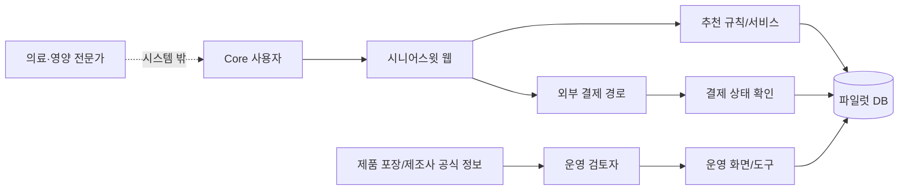
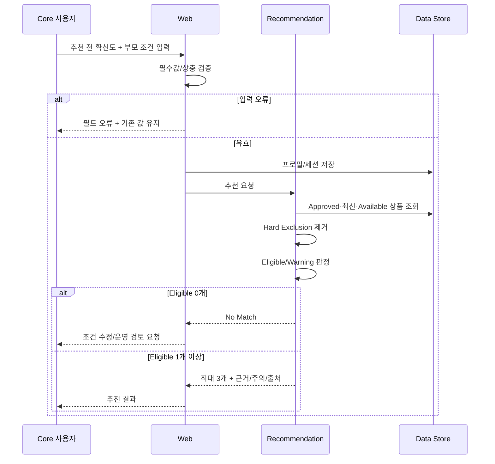
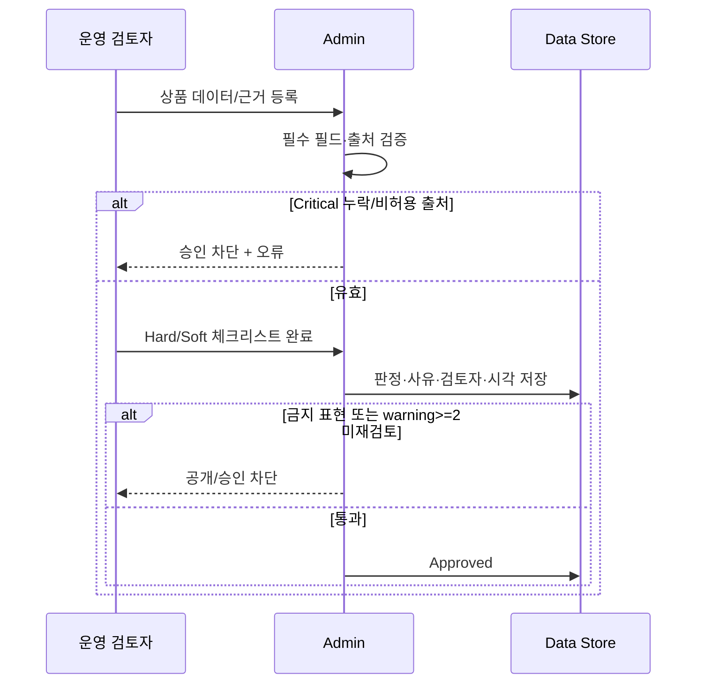
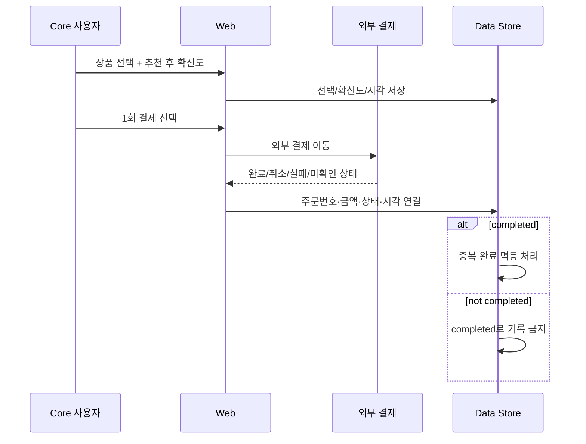
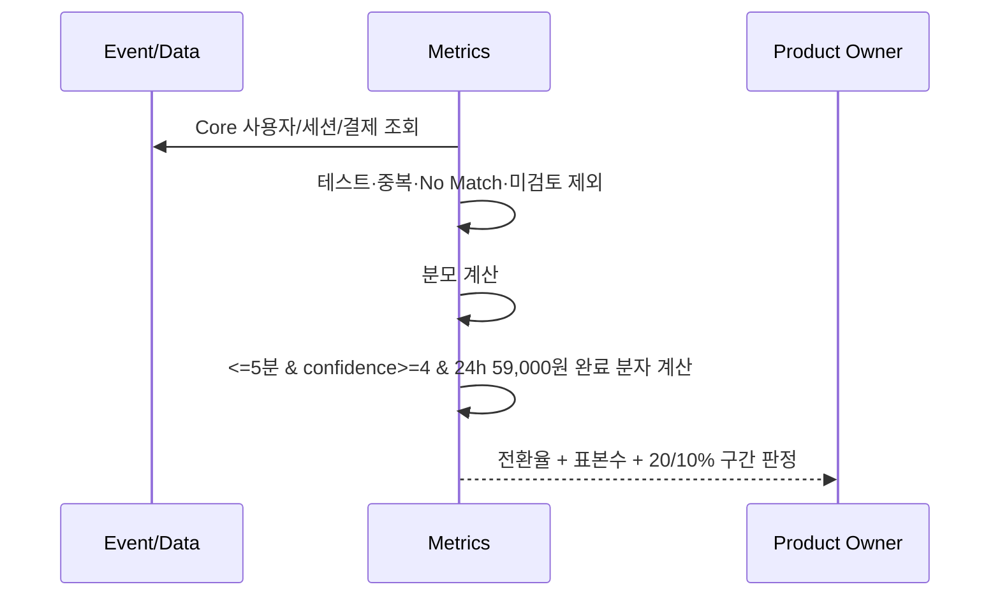

# Software Requirements Specification (SRS) — 시니어스윗 저당식품 큐레이션 서비스

## 1. 문서 정보

| 항목 | 내용 |
|---|---|
| **Document ID** | SRS-LOW-SUGAR-001 |
| **문서명** | 시니어스윗 저당식품 큐레이션 서비스 소프트웨어 요구사항 명세 |
| **Revision** | 1.1 |
| **상태** | **Implementation Baseline — Open Questions 추적** |
| **상위 문서** | `01_PRD.md` (PRD-LOW-SUGAR-001 v1.1, Approved for Implementation Baseline) |
| **요구 원천** | `김지수_20260801_3주차프로젝트.md` |
| **작성일** | 2026-09-11 |
| **Standard** | ISO/IEC/IEEE 29148:2018 구조 참고 |
| **연계 문서** | `PROJECT_SCOPE.md`, `03_UI_COVERAGE_ANALYSIS.md`, `04_UIUX_PLAN.md` |
| **Owner** | Product & Engineering & Operations |
| **대상 플랫폼** | 모바일 우선 반응형 웹 |

### 1-1. 상태의 의미

본 SRS는 3주차 프로젝트에서 확정된 PRD, 추천 결정표, 상품 데이터 구조, 조건별 테스트 케이스를 구현 가능한 요구사항으로 변환한다. **프로젝트 원문에서 근거가 없는 값을 임의로 확정하지 않으며**, 구현 또는 파일럿 전 결정이 필요한 항목은 `[결정 필요]`로 표시하고 §17 Open Questions에서 추적한다.

### 1-2. 요구사항 규모

| 구분 | 수량 |
|---|---:|
| 기능 요구사항 | 25 |
| 비기능 요구사항 | 26 |
| 논리 데이터 엔터티 | 8 |
| 외부 인터페이스 | 4 |
| 논리 API | 14 |
| 오류 코드 | 16 |
| 핵심 시퀀스 다이어그램 | 4 |
| Test Case | 40 |
| Open Questions | 10 |

---

## 2. Introduction

### 2-1. Purpose

본 SRS는 PRD-LOW-SUGAR-001이 정의한 제품 요구를 개발·검수·운영 관점에서 **식별 가능하고 시험 가능한 소프트웨어/운영 요구사항**으로 변환한다.

| ID | 목적 | 출처 |
|---|---|---|
| **PUR-01** | PRD의 Feature·Story·Acceptance Criteria를 개별 요구사항으로 분해한다 | PRD §4, §5 |
| **PUR-02** | 추천 판단의 경계와 데이터 책임을 명시해 “의학적 추천”으로 확장되는 것을 방지한다 | PRD §2-4, §3-3, §6 |
| **PUR-03** | Software Must·Operational Must·Experiment Must의 책임을 분리한다 | PRD §5 |
| **PUR-04** | 추천·운영 검토·결제·측정 흐름이 동일한 완료 기준을 사용하도록 한다 | PRD §11, §12 |
| **PUR-05** | 근거가 부족한 값은 Open Questions로 분리해 요구사항 창작을 방지한다 | PRD §6-2, §12-2 |

**독자:** 개발자, QA, 제품 오너, 운영 검토자, 파일럿 분석 담당자, 개인정보/규제 검토 담당자.

### 2-2. Product Summary

시니어스윗은 **저당 제품 검색 쇼핑몰이 아니라 부모 조건과 식품 표시정보를 연결해 최대 3개의 후보와 선정 근거를 제공하는 큐레이션 서비스**이다. 질환 진단·치료 효과·의학적 안전성을 판단하지 않으며, 입력 조건과 확인 가능한 표시정보의 충돌·일치 여부를 설명하는 범위로 한정한다.

| ID | 특성 | 내용 | 출처 |
|---|---|---|---|
| **PS-01** | 해결 문제 | 표시정보를 봐도 부모 조건에 맞는지 판단하기 어렵고 반복 탐색 비용이 크다 | PRD PAIN-01~04 |
| **PS-02** | 핵심 기능 | F1 프로필, F2 Top 3+근거, F3-A 수동 검토, F6-A 실결제 | PRD §5 |
| **PS-03** | 차별 가치 | “왜 우리 부모에게 맞는지” 설명 + 명백한 조건 충돌 사전 제거 | PRD §3 |
| **PS-04** | Core 사용자 | 40~59세 직장인 자녀, 65~79세 부모와 별거, 최근 당 관리 주의, 온라인 식품 발송 경험 | PRD §2 |
| **PS-05** | 핵심 지표 | 확신 기반 1회 결제 전환율 20% 이상 가설 | PRD §1-4 |
| **PS-06** | 제품 경계 | 의료 판단, 구독, AI 학습 추천, 재주문 자동화는 MVP에서 제외 | PRD §9 |

### 2-3. Definitions

| 용어 | 정의 |
|---|---|
| **Core 사용자** | PRD §2-2 포함 기준을 모두 충족하고 제외 기준에 해당하지 않는 파일럿 참여자 |
| **`cohort_id`** | 파일럿에서 중복 사용자를 구분하기 위한 고유 식별자 |
| **부모 프로필** | 당 관리 주의 여부, 알레르기 상태·성분, 제외 성분, 선호·섭취 곤란 식감 등 현재 세션 추천 입력 |
| **Hard Exclusion** | 알레르기·제외 성분·섭취 곤란 식감의 직접 충돌 또는 필수 표시정보 부재로 추천 후보에서 제거해야 하는 상태 |
| **Soft Warning** | 직접 제외 조건은 아니나 추가 확인 또는 사용자 주의 표시가 필요한 상태 |
| **Eligible** | Hard Exclusion이 없고 필수 데이터가 완전하며 선정 이유 2개 이상을 제시할 수 있는 추천 가능 상태 |
| **No Match** | Eligible 후보가 0개인 상태. 임의 상품으로 채우지 않는다 |
| **선정 근거** | 사용자 입력 조건과 제품 표시정보를 연결해 설명하는 문장. 제품별 2개 이상 필요 |
| **공식 근거 출처** | 제품 포장 표시, 제조사 공식 제품 정보, 현행 식품 표시 기준, 내부 검토 기록 |
| **검토 만료** | `source_checked_at` 또는 `reviewed_at`이 90일을 초과한 상태 |
| **확신도** | “이 추천을 믿고 부모님 간식을 선택할 수 있다”에 대한 5점 척도 자기평가 |
| **확신 기반 1회 결제** | 5분 이내 선택 + 확신도 4점 이상 + 24시간 내 59,000원 결제를 모두 충족한 건 |
| **Operational Must** | 소프트웨어 자동화 여부와 무관하게 MVP 운영에서 반드시 수행해야 하는 업무 |
| **Experiment Must** | 시장 가설 검증을 위해 반드시 존재해야 하는 실험 경로·데이터 |

### 2-4. References

| ID | 출처 | 활용 |
|---|---|---|
| **DOC-01** | `01_PRD.md` | 상위 제품 요구 원천 |
| **DOC-02** | `김지수_20260801_3주차프로젝트.md` | VPS·MoSCoW·완성 PRD·파일럿 검증·SRS 입력 부록 |
| **REF-01** | 제품 포장 표시정보 | 상품 근거 원천 |
| **REF-02** | 제조사 공식 제품 정보 | 상품 근거 원천 |
| **REF-03** | 현행 식품 표시 기준 | 표시 해석·운영 검토 근거 |

> REF-03의 구체 법령/고시명·버전은 제품 원문에 확정되어 있지 않으므로 `[결정 필요]`이며 OQ-08에서 추적한다.

---

## 3. Scope

### 3-1. In Scope

| ID | 범위 항목 | 관련 기능 | 출처 |
|---|---|---|---|
| **SC-IN-01** | Core 사용자 스크리닝 통과 여부와 `cohort_id` 관리 | 측정 | PRD §2-2, Story 5 |
| **SC-IN-02** | 추천 전 확신도 입력 | 측정 | Story 5 |
| **SC-IN-03** | 부모 조건 입력·검증·요약 | F1 | Story 1 |
| **SC-IN-04** | Approved 제한 상품군의 상품·출처 데이터 | F2/F3 | PRD §6, §8 |
| **SC-IN-05** | Hard Exclusion·Soft Warning·Eligible·No Match 판정 | F2/F3 | PRD §3-3 |
| **SC-IN-06** | 최대 3개 추천, 제품별 선정 이유 2개 이상, 주의사항, 근거 표시 | F2 | Story 2 |
| **SC-IN-07** | 수동 운영 검토와 감사 기록 | F3-A | Story 3 |
| **SC-IN-08** | 추천 후 확신도·선택 시간·추천 없음 측정 | 측정 | Story 5 |
| **SC-IN-09** | 외부 1회 결제 이동과 결제 상태 기록 | F6-A | Story 4 |
| **SC-IN-10** | KPI 산출용 최소 이벤트 및 파일럿 집계 | 측정 | PRD §1-4 |

### 3-2. MoSCoW

| 등급 | 기능 |
|---|---|
| **Software Must** | F1 부모 조건 프로필, F2 Top 3 추천·선정 근거 |
| **Operational Must** | F3-A 수동 조건 충돌 검토 |
| **Experiment Must** | F6-A 실제 1회 결제 경로·결제 상태 기록 |
| **Should** | F3-B 자동 충돌 필터, F4 적합성 요약, F6-B 자체 결제 편의 |
| **Could** | F5 부모 섭취 반응 수집 |
| **Won't** | F7 재주문, F8 반응 기반 다음 추천, 구독, AI 학습 추천, 전체 상품 검색·최저가 비교, 의료 판단 등 PRD §9-2 |

### 3-3. Out of Scope

PRD §9-2의 14개 배제 항목을 변경하지 않는다. 특히 아래는 시스템 요구사항으로 변환하지 않는다.

- 다음 방문 프로필 자동 불러오기·재주문
- 정기구독·자동결제
- 전체 상품 검색·최저가 비교
- 대규모 상품 자동 수집
- AI 학습 추천
- 혈당 수치 기반 개인화·질환 진단·치료 조언
- 리뷰·커뮤니티·포인트
- 부모용 별도 앱·네이티브 앱
- 자체 물류·창고

### 3-4. Assumptions

| ID | 가정 | 검증 |
|---|---|---|
| **AS-01** | 공식 표시정보·검토자·검토일이 고객 신뢰를 높인다 | 신뢰도 실험 |
| **AS-02** | 59,000원 1회 가격이 수용 가능하다 | 실제 결제 전환율 |
| **AS-03** | 추천이 기존 탐색보다 시간을 줄인다 | Baseline vs 서비스 |
| **AS-04** | 수동 검토 P90이 10분 이내다 | 운영 계측 |
| **AS-05** | 초기 상품군이 대표 조건을 커버한다 | 커버리지 매트릭스 |
| **AS-06** | 식감 통제 어휘를 일관되게 적용 가능하다 | 2인 분류 일치도 |

### 3-5. Constraints

| ID | 제약 |
|---|---|
| **CON-01** | 추천은 의학적 적합성·질환 안전성을 판정하지 않는다 |
| **CON-02** | 사전 검토된 제한 상품군만 추천한다 |
| **CON-03** | 최대 3개만 노출하며 기준 미달 상품으로 채우지 않는다 |
| **CON-04** | 선정 이유는 사용자 입력과 공식 표시정보에 직접 연결한다 |
| **CON-05** | 의료·건강 보장성 금지 표현을 공개하지 않는다 |
| **CON-06** | 프로필은 다음 방문 재주문·자동추천에 사용하지 않는다 |
| **CON-07** | 주민등록번호·진료기록·혈당 원자료를 수집하지 않는다 |
| **CON-08** | 자체 PG·정기구독·자동결제를 MVP 필수 구현으로 두지 않는다 |
| **CON-09** | 실제 상품 데이터가 없는 상태에서 추천 정렬 가중치를 임의로 확정하지 않는다 |

---

## 4. Stakeholders

### 4-1. 역할

| 역할 | 책임 |
|---|---|
| **Core 사용자** | 부모 조건 입력, 확신도 응답, 추천 확인, 상품 선택, 실결제 |
| **제품 오너** | KPI·범위·실험 판정, Open Question 결정 |
| **운영 검토자** | 상품 정보 수집, Hard/Soft 판정, 선정 근거 검토, 최신성 관리 |
| **개발자** | Software Must·측정·결제 상태 연결 구현 |
| **QA** | 요구사항·AC·Test Case 검증 |
| **파일럿 분석 담당자** | 중복 제거, KPI 분모·분자 산출, Go/Retry/Pivot 판정 자료 생성 |
| **개인정보/규제 검토 담당자** | 프로필 보존·삭제·동의와 비의료적 표현 경계 검토 |

### 4-2. 권한

| 역할 | 일반 추천 | 상품/검토 관리 | 결제 기록 | 분석 데이터 |
|---|---:|---:|---:|---:|
| Core 사용자 | 본인 세션만 | 없음 | 본인 결제 진행 | 본인 화면 값만 |
| 운영 검토자 | 검수용 | 생성·수정·검토 | 상태 확인 최소 권한 | 운영 지표 일부 |
| 제품 오너 | 전체 | 승인 정책 관리 | 집계 조회 | 전체 집계 |
| QA | 테스트 환경 | 테스트 데이터 | 테스트 결제 상태 | 테스트 데이터 |
| 분석 담당자 | 식별 최소화 데이터 | 없음 | 상태·시각 | 집계/분석 |

관리자 권한 등급과 계정 발급 방식은 `[결정 필요]`(OQ-06).

---

## 5. System Context

### 5-1. System Boundary

시스템은 부모 조건 입력, 추천 판정/표시, 파일럿 이벤트 기록, 운영 검토 데이터, 외부 결제 상태 연결을 책임진다. 실제 결제 수단 처리·식품 제조·배송·의료 판단은 시스템 경계 밖이다.

### 5-2. 시스템 책임

1. 유효한 프로필만 추천 단계로 전달한다.
2. Approved·최신·재고 가능 상품만 후보 풀에 포함한다.
3. Hard Exclusion을 우선 적용한다.
4. Soft Warning을 사용자에게 표시하고 2개 이상이면 운영자 재검토를 요구한다.
5. Eligible 후보만 정렬하고 최대 3개만 노출한다.
6. 후보가 없으면 No Match를 명시한다.
7. 제품별 선정 이유 2개 이상과 출처·검토일을 제공한다.
8. 금지 표현을 공개 상태로 전환하지 않는다.
9. 결제 상태를 완료·취소·실패·미완료로 구분한다.
10. KPI에 필요한 세션·확신도·선택·결제 이벤트를 연결한다.

### 5-3. 외부 책임

- 결제 제공자/외부 결제 경로: 실제 금전 처리, 승인·취소 원천 상태
- 제조사/제품 포장: 공식 표시정보 원천
- 식품 판매·배송 운영 주체: 주문 이행·배송·환불 실무 `[결정 필요]`(OQ-09)
- 의료·영양 전문가: 서비스 대상에서 제외되는 전문 판단 필요 사례

### 5-4. Implementation Baseline Architecture

본 절은 제품 가설이 아니라 **이번 MVP 구현 문서 세트에서 사용할 기술 기준**이다. 의료·규제적 의미를 확장하지 않으며 `PROJECT_SCOPE.md`가 더 좁은 범위를 정하면 Scope가 우선한다.

| 영역 | 기준 |
|---|---|
| Web | Next.js App Router + TypeScript |
| UI | Tailwind CSS + shadcn/ui 기반 커스텀 컴포넌트 |
| Data | Supabase PostgreSQL |
| Operator Auth | Supabase Auth. Core 사용자는 MVP에서 회원가입 없이 `cohort_id` 기반 세션 사용 |
| Authorization | Reviewer/Admin 역할을 서버 측에서 검증 |
| Hosting | Vercel |
| Test | Playwright 핵심 Smoke/E2E + 수동 운영 검수 |
| Payment | 외부 결제 링크. 제공자 미확정 동안 주문번호·상태를 운영자가 확인/기록하며 카드 원정보는 저장하지 않음 |
| Recommendation | ML 학습 모델이 아닌 규칙 기반 Hard Exclusion + 사전 승인 상품 + 설명 가능한 정렬 |

#### 5-4-1. 디자인 Screen·Route Inventory

| Screen | Route | 접근 | 책임 |
|---|---|---|---|
| SCR-001 | `/` | Public | 안내·Core 스크리닝·추천 전 확신도 |
| SCR-002 | `/recommend` | 유효 파일럿 세션 | 부모 조건·추천·근거·추천 후 확신도·상품 선택 |
| SCR-003 | `/order` | 선택 완료 세션 | 결제 전 요약·외부 결제·상태 안내 |
| SCR-004 | `/admin/products` | Reviewer/Admin | 상품·출처·검토·승인·만료 |
| SCR-005 | `/admin/pilot` | Admin/Product Owner | 파일럿 KPI·운영 지표·결제 연결 확인 |

**기술 Route(비Screen):** `/payment/return`, 인증 callback, Server Action/API endpoint, `/privacy`, `/terms`, 404/500.

#### 5-4-2. 구현 데이터 책임

- `PRODUCT`, `PRODUCT_REVIEW`는 운영자가 구조화된 필드로 관리한다.
- `PARENT_PROFILE`은 현재 추천 세션에 연결하며 다음 방문 자동 채움에 사용하지 않는다.
- `RECOMMENDATION_SESSION`과 `EVENT_LOG`는 KPI 계산에 필요한 최소 이벤트만 저장한다.
- 결제수단 번호·카드 정보·주민등록번호·진료기록·혈당 원자료는 저장하지 않는다.
- 제품 근거 원문은 URL 또는 증빙 파일 참조로 추적하되, 일반 리뷰·블로그는 승인 근거가 될 수 없다.

---

## 6. 기능 요구사항

### 6-0. 필드 정의

| 필드 | 의미 |
|---|---|
| **Requirement** | 시스템 또는 운영 프로세스가 수행해야 하는 단일 책임 |
| **Priority** | PRD의 Software/Operational/Experiment Must 및 MoSCoW |
| **Source** | PRD Story·AC·정책·Risk |
| **Input · Preconditions · Processing Rules · Output · Exceptions** | 정상/실패 흐름 |
| **Acceptance Criteria** | 정량 또는 명시 판정 기준 |
| **Verification** | 시험 · 검사 · 시연 · 분석 |

### 6-1. Core 스크리닝·측정 — REQ-FUNC-COHORT

#### REQ-FUNC-COHORT-001 — Core 스크리닝 상태 기록

| 필드 | 내용 |
|---|---|
| **Requirement** | 시스템 또는 파일럿 운영 도구는 참여자의 Core 포함·제외 판정을 기록하고 통과자에게 중복 없는 `cohort_id`를 부여해야 한다. |
| **Priority** | Experiment Must |
| **Source** | PRD §2-2 / AC-M01 |
| **Input** | 스크리닝 응답 |
| **Preconditions** | 파일럿 참여 동의 절차가 완료되었다 `[결정 필요]`(OQ-07). |
| **Processing Rules** | 1. PRD 포함 기준 6개를 모두 확인한다. 2. 제외 기준 4개 중 하나라도 해당하면 Core 통과 처리하지 않는다. 3. 통과자마다 `cohort_id`를 1개 부여한다. 4. 동일 참여자의 중복 발급 방지 방식은 OQ-05. |
| **Output** | `screening_status`, `cohort_id` 또는 `exclusion_code` |
| **Exceptions** | E1. 필수 스크리닝 응답 누락 → 통과 처리하지 않는다. E2. 전문 판단 필요 제외 기준 → 안내 후 파일럿 추천을 시작하지 않는다. |
| **Acceptance Criteria** | 중복 `cohort_id` **0건**, 제외 기준 대상의 Core 통과 **0건** |
| **Verification** | 시험·검사 → TC-COHORT-001~002 |

#### REQ-FUNC-COHORT-002 — 추천 전 확신도 기록

| 필드 | 내용 |
|---|---|
| **Requirement** | 시스템은 프로필 입력 전에 5점 척도의 추천 전 확신도와 측정 시각을 기록해야 한다. |
| **Priority** | Experiment Must |
| **Source** | PRD AC-M02 / GOAL-02 |
| **Input** | 1~5 확신도 |
| **Preconditions** | Core 스크리닝 통과 |
| **Processing Rules** | 1. 값은 1~5 정수만 허용한다. 2. 동일 추천 세션에 1개의 pre-score를 연결한다. 3. 측정 시각과 `cohort_id`, `session_id`를 연결한다. |
| **Output** | `confidence_pre` |
| **Exceptions** | E1. 값 누락/범위 밖 → 프로필 시작 차단 여부는 `[결정 필요]`(OQ-01). KPI 분석에는 결측으로 표시한다. |
| **Acceptance Criteria** | 유효 범위 밖 저장 **0건** |
| **Verification** | 시험 → TC-COHORT-003 |

### 6-2. 부모 조건 프로필 — REQ-FUNC-PROFILE (F1)

#### REQ-FUNC-PROFILE-001 — 필수 부모 조건 입력

| 필드 | 내용 |
|---|---|
| **Requirement** | 시스템은 당 관리 주의 여부, 알레르기 여부, 섭취 곤란 식감을 필수 입력으로 수집해야 한다. |
| **Priority** | Software Must |
| **Source** | PRD Story 1 / AC-P01, AC-P03 |
| **Input** | `sugar_management`(예/아니요/모름), `allergy_status`(없음/있음/모름), `difficult_texture_tags` |
| **Preconditions** | 유효 추천 세션 존재 |
| **Processing Rules** | 1. 세 필수 축이 모두 입력되어야 추천 가능 상태가 된다. 2. 식감은 통제 어휘 6종만 허용한다. 3. 정확한 의료 진단명·혈당 원자료를 입력 필드로 제공하지 않는다(CON-07). |
| **Output** | 검증 가능한 부모 조건 프로필 |
| **Exceptions** | E1. 필수값 누락 → 항목별 오류 표시, 다른 입력 보존. |
| **Acceptance Criteria** | 누락 식별 **100%**, 누락 상태 추천 이동 **0건** |
| **Verification** | 시험 → TC-PROFILE-001 |

#### REQ-FUNC-PROFILE-002 — 알레르기 조건부 필수와 상충 검증

| 필드 | 내용 |
|---|---|
| **Requirement** | 시스템은 `알레르기 있음`인 경우 성분 1개 이상을 요구하고, `알레르기 없음`과 구체 알레르기 성분의 동시 입력을 차단해야 한다. |
| **Priority** | Software Must |
| **Source** | PRD AC-P02, AC-P04 |
| **Input** | `allergy_status`, `allergy_ingredients` |
| **Preconditions** | 프로필 입력 화면 |
| **Processing Rules** | 1. `있음` → 성분 1개 이상 필수. 2. `없음` → 알레르기 성분 목록은 비어 있어야 한다. 3. `모름` → 성분 입력은 선택이며 Soft Warning 규칙을 발생시킨다. |
| **Output** | 일관된 알레르기 조건 |
| **Exceptions** | 상충 입력 시 저장/추천 이동을 차단하고 오류를 표시한다. |
| **Acceptance Criteria** | 상충 입력 통과 **0건**, `있음`+성분 누락 통과 **0건** |
| **Verification** | 시험 → TC-PROFILE-002~003 |

#### REQ-FUNC-PROFILE-003 — 조건 요약과 수정

| 필드 | 내용 |
|---|---|
| **Requirement** | 시스템은 추천 실행 전에 현재 프로필 조건을 요약해 표시하고 수정할 수 있게 해야 한다. |
| **Priority** | Software Must |
| **Source** | PRD AC-P01 / FR-01 |
| **Input** | 검증된 프로필 |
| **Preconditions** | PROFILE-001~002 통과 |
| **Processing Rules** | 요약에 당 관리 상태, 알레르기/성분, 제외 성분, 선호 식감, 섭취 곤란 식감을 표시한다. 입력하지 않은 선택 필드는 생략하거나 `없음/미입력`으로 구분한다. |
| **Output** | 조건 요약 화면 |
| **Exceptions** | 수정 후 유효성이 깨지면 추천 실행을 다시 차단한다. |
| **Acceptance Criteria** | 저장값과 요약 불일치 **0건** |
| **Verification** | 시험 → TC-PROFILE-004 |

#### REQ-FUNC-PROFILE-004 — 다음 방문 자동 재사용 금지

| 필드 | 내용 |
|---|---|
| **Requirement** | 시스템은 MVP에서 이전 세션의 부모 프로필을 다음 방문 추천 입력으로 자동 로드하거나 재주문에 사용하지 않아야 한다. |
| **Priority** | Must Constraint |
| **Source** | PRD AC-P05 / 제품 원칙 7 / CON-06 |
| **Input** | 이전 세션 프로필 |
| **Preconditions** | 새 추천 세션 시작 |
| **Processing Rules** | 1. 새 세션은 빈 프로필에서 시작한다. 2. 분석용 보관 데이터가 존재하더라도 UI 자동 채움·추천 입력으로 사용하지 않는다. |
| **Output** | 빈 신규 프로필 |
| **Exceptions** | 없음 |
| **Acceptance Criteria** | 자동 재사용 **0건** |
| **Verification** | 시험 → TC-PROFILE-005 |

### 6-3. 상품 검토 — REQ-FUNC-REVIEW (F3-A)

#### REQ-FUNC-REVIEW-001 — 상품 필수 데이터 완전성 검사

| 필드 | 내용 |
|---|---|
| **Requirement** | 운영 도구는 상품이 PRD §8-2의 필수 필드를 모두 갖추지 않으면 `Approved`로 전환할 수 없게 해야 한다. |
| **Priority** | Operational Must |
| **Source** | PRD Story 3 / AC-O01, AC-O03 / §6-1 |
| **Input** | 상품 데이터 |
| **Preconditions** | 상품이 Draft 또는 Review 상태 |
| **Processing Rules** | 필수 필드 누락을 검출하고 누락 목록을 반환한다. 특히 당류·원재료·알레르기·출처는 Critical이다. |
| **Output** | 완전성 결과 |
| **Exceptions** | Critical 누락 시 추천 대상이 될 수 없다. |
| **Acceptance Criteria** | 필수 필드 누락 상품의 Approved 전이 **0건** |
| **Verification** | 시험·검사 → TC-REVIEW-001 |

#### REQ-FUNC-REVIEW-002 — 허용 근거 출처 제한

| 필드 | 내용 |
|---|---|
| **Requirement** | 운영 도구는 추천 근거 출처를 제품 포장 표시, 제조사 공식 정보, 현행 표시 기준, 내부 검토 기록 범위로 제한해야 한다. |
| **Priority** | Operational Must |
| **Source** | PRD §3-4, §6-4 |
| **Input** | `source_type`, `source_reference` |
| **Preconditions** | 상품 검토 |
| **Processing Rules** | 블로그·인플루언서·출처 불명 리뷰를 근거 유형으로 승인하지 않는다. 현행 표시 기준의 구체 코드 체계는 OQ-08. |
| **Output** | 유효 근거 또는 출처 오류 |
| **Exceptions** | 출처가 유효하지 않으면 Approved 불가. |
| **Acceptance Criteria** | 비허용 출처만으로 승인된 상품 **0건** |
| **Verification** | 검사 → TC-REVIEW-002 |

#### REQ-FUNC-REVIEW-003 — Hard Exclusion 판정 기록

| 필드 | 내용 |
|---|---|
| **Requirement** | 운영 도구는 알레르기·제외 성분·섭취 곤란 식감·필수 표시정보 부재에 대한 Hard Exclusion 판정과 사유를 기록해야 한다. |
| **Priority** | Operational Must |
| **Source** | PRD §3-3 / AC-O03 |
| **Input** | 부모 조건, 상품 속성 또는 상품 일반 검토 |
| **Preconditions** | 해당 상품의 표시정보가 존재하거나 부재가 확인됨 |
| **Processing Rules** | 1. `allergen_contains` 또는 `allergen_may_contain`에 사용자 알레르기 성분이 포함되면 제외. 2. 사용자 제외 성분이 원재료에 포함되면 제외. 3. 섭취 곤란 식감과 주/보조 식감이 직접 충돌하면 제외. 4. 필수 Critical 표시정보 출처가 없으면 제외. |
| **Output** | Hard Exclusion 여부, 코드, 근거 |
| **Exceptions** | 다중 충돌은 모든 사유를 기록한다. |
| **Acceptance Criteria** | 검증 케이스에서 Critical 충돌 누락 **0건** |
| **Verification** | 시험 → TC-F2-01, TC-F2-03, TC-F2-04 |

#### REQ-FUNC-REVIEW-004 — Soft Warning 판정과 재검토 게이트

| 필드 | 내용 |
|---|---|
| **Requirement** | 시스템/운영 도구는 Soft Warning을 기록하고 2개 이상인 상품을 자동 노출하지 않아야 한다. |
| **Priority** | Operational Must |
| **Source** | PRD §3-3 / AC-O04 |
| **Input** | 식감 불명확, 알레르기 모름, 추가 확인 필요, 선호 식감 불일치 등 |
| **Preconditions** | Hard Exclusion 없음 |
| **Processing Rules** | 1. Soft Warning 0~1개 → 후보 포함 가능. 2. 2개 이상 → 운영자 재검토 완료 전 자동 노출 금지. |
| **Output** | warning 목록, `needs_manual_review` |
| **Exceptions** | 재검토에서 Hard Exclusion 발견 시 REVIEW-003으로 전환. |
| **Acceptance Criteria** | Soft Warning 2개 이상 미검토 자동 노출 **0건** |
| **Verification** | 시험 → TC-REVIEW-003 |

#### REQ-FUNC-REVIEW-005 — 검토 상태와 90일 만료

| 필드 | 내용 |
|---|---|
| **Requirement** | 상품 검토 상태는 Draft·Review·Approved·Expired를 사용하며 Approved 정보가 90일을 초과하면 자동 추천 대상에서 제외해야 한다. |
| **Priority** | Operational Must |
| **Source** | PRD §6-1 / AC-O05 |
| **Input** | `review_status`, `source_checked_at`, `reviewed_at` |
| **Preconditions** | 상품 데이터 존재 |
| **Processing Rules** | 추천 대상 조회 시 `source_checked_at` 또는 `reviewed_at` 최신 기준이 90일 이내인지 확인한다. 어떤 날짜를 우선할지는 가장 최근 유효 검토일을 사용한다. |
| **Output** | 유효 Approved 또는 Expired/재검토 상태 |
| **Exceptions** | 날짜 누락은 Expired와 동일하게 추천 제외. |
| **Acceptance Criteria** | 90일 초과 상품 자동 추천 **0건** |
| **Verification** | 시험 → TC-REVIEW-004 |

#### REQ-FUNC-REVIEW-006 — 금지 표현 공개 차단

| 필드 | 내용 |
|---|---|
| **Requirement** | 운영 도구는 선정 근거에 PRD §6-4의 금지 의료·건강 표현이 포함되면 공개 상태 전환을 차단해야 한다. |
| **Priority** | Operational Must |
| **Source** | PRD AC-R07 / §6-4 |
| **Input** | 선정 근거 문장 |
| **Preconditions** | 추천 콘텐츠 공개/승인 시도 |
| **Processing Rules** | 최소 금지 개념: `안전하다`, `혈당을 올리지 않는다`, `당뇨 환자에게 적합`, `의사가 추천`, `가장 건강`, `섭취해도 문제없음`. 정확한 탐지 구현은 사전 목록+검토자 승인으로 시작할 수 있다. |
| **Output** | 공개 차단, 금지 표현 코드 |
| **Exceptions** | 문구 수정 후 재검토 가능. |
| **Acceptance Criteria** | 테스트 금지 표현의 공개 성공 **0건** |
| **Verification** | 시험 → TC-F2-06 |

### 6-4. 추천 생성·표시 — REQ-FUNC-RECO (F2)

#### REQ-FUNC-RECO-001 — 추천 후보 풀 게이트

| 필드 | 내용 |
|---|---|
| **Requirement** | 시스템은 Approved·최신·Available·필수 데이터 완전 상품만 추천 후보 풀에 포함해야 한다. |
| **Priority** | Software Must |
| **Source** | PRD §6-1 / AC-R05 |
| **Input** | 상품 목록 |
| **Preconditions** | 유효 부모 프로필 |
| **Processing Rules** | `review_status=Approved`, 최신성 90일 이내, `stock_status=Available`, 필수 필드 완전 여부를 모두 AND 조건으로 적용한다. |
| **Output** | 기본 후보 풀 |
| **Exceptions** | 후보 0건이면 RECO-005로 이행. |
| **Acceptance Criteria** | 미승인·만료·재고불가·필수누락 노출 **0건** |
| **Verification** | 시험 → TC-RECO-001 |

#### REQ-FUNC-RECO-002 — 사용자 조건 기반 Hard Exclusion 적용

| 필드 | 내용 |
|---|---|
| **Requirement** | 시스템은 후보 상품과 현재 부모 프로필을 비교해 Hard Exclusion 상품을 추천 대상에서 제거해야 한다. |
| **Priority** | Software Must |
| **Source** | PRD AC-R04 / §3-3 |
| **Input** | 부모 프로필, 기본 후보 풀 |
| **Preconditions** | RECO-001 통과 |
| **Processing Rules** | REVIEW-003의 4개 Hard Exclusion 규칙을 동일하게 적용한다. 자동화가 완전하지 않은 파일럿에서는 운영자 사전 판정 결과를 입력으로 사용할 수 있다. |
| **Output** | Eligible 판정 대상 후보 |
| **Exceptions** | 모든 상품 제외 시 RECO-005. |
| **Acceptance Criteria** | 검증된 Hard Exclusion 상품 추천 화면 노출 **0건** |
| **Verification** | 시험 → TC-F2-01, TC-F2-03, TC-F2-04 |

#### REQ-FUNC-RECO-003 — Eligible·Soft Warning 판정

| 필드 | 내용 |
|---|---|
| **Requirement** | 시스템은 Hard Exclusion이 없는 상품 중 선정 이유 2개 이상을 만들 수 있는 상품을 Eligible로 처리하고 Soft Warning을 함께 유지해야 한다. |
| **Priority** | Software Must |
| **Source** | PRD §3-3 / AC-R01 |
| **Input** | 후보 상품, 부모 프로필, warning 목록 |
| **Preconditions** | RECO-002 통과 |
| **Processing Rules** | 1. 조건 연결 선정 이유가 2개 미만이면 자동 추천하지 않는다. 2. Soft Warning 2개 이상은 운영자 재검토 완료 상태일 때만 Eligible 가능. 3. Warning은 추천 화면에 표시한다. |
| **Output** | Eligible 후보와 근거/주의사항 |
| **Exceptions** | 근거 부족 시 후보 제외 사유 `INSUFFICIENT_RATIONALE`. |
| **Acceptance Criteria** | 제품별 선정 이유 2개 미만 노출 **0건** |
| **Verification** | 시험 → TC-RECO-002 |

#### REQ-FUNC-RECO-004 — 정렬과 최대 3개 노출

| 필드 | 내용 |
|---|---|
| **Requirement** | 시스템은 Eligible 상품만 정렬하고 최대 3개를 노출하며, 후보가 1~2개면 해당 수만 표시해야 한다. |
| **Priority** | Software Must |
| **Source** | PRD AC-R01, AC-R02 / §6-2 |
| **Input** | Eligible 후보 |
| **Preconditions** | 후보 1개 이상 |
| **Processing Rules** | 1. 노출 상한은 3개. 2. 후보 1~2개면 기준 미달 상품으로 보충하지 않는다. 3. 동점 처리는 warning 적음 → 검토일 최신 → 가격 낮음 순. 4. 점수 가중치는 `[결정 필요]`(OQ-02); 확정 전에는 운영자가 사전 지정한 순서 또는 결정된 단순 규칙을 사용한다. |
| **Output** | 1~3개 추천 |
| **Exceptions** | 후보 0개 → RECO-005. |
| **Acceptance Criteria** | 3개 초과 노출 **0건**, 기준 미달 보충 **0건** |
| **Verification** | 시험 → TC-F2-02, TC-RECO-003 |

#### REQ-FUNC-RECO-005 — No Match 처리

| 필드 | 내용 |
|---|---|
| **Requirement** | Eligible 후보가 0개이면 시스템은 상품을 추천하지 않고 No Match 안내, 조건 수정, 운영자 검토 요청 수단을 제공해야 한다. |
| **Priority** | Software Must |
| **Source** | PRD AC-R03 / Story 2 |
| **Input** | Eligible 후보 0건 |
| **Preconditions** | 유효 프로필 |
| **Processing Rules** | 1. 조건을 자동 완화하지 않는다. 2. 임의 상품을 표시하지 않는다. 3. No Match 이벤트를 기록한다. 4. 운영자 검토 요청의 처리 SLA·채널은 `[결정 필요]`(OQ-03). |
| **Output** | No Match 안내와 다음 행동 |
| **Exceptions** | 조회 장애와 No Match를 동일하게 표시하지 않는다. |
| **Acceptance Criteria** | No Match에서 상품 노출 **0건**, 조건 수정 수단 존재 |
| **Verification** | 시험 → TC-F2-05, TC-RECO-004 |

#### REQ-FUNC-RECO-006 — 선정 근거·출처·비의료적 경계 표시

| 필드 | 내용 |
|---|---|
| **Requirement** | 각 추천 상품에 선정 이유 2개 이상, 사용자 조건과의 연결, 주의사항, 근거 출처 유형, 검토일, 비의료적 한계 안내를 표시해야 한다. |
| **Priority** | Software Must |
| **Source** | PRD AC-R01, AC-R06 / Story 4 AC-C01 |
| **Input** | 추천 항목 |
| **Preconditions** | RECO-003~004 통과 |
| **Processing Rules** | 당류 상대 비교를 사용하는 경우 1회 섭취량 기준 수치와 “파일럿 상품군 내 상대 비교”임을 함께 표시한다. |
| **Output** | 추천 카드/상세 근거 |
| **Exceptions** | 출처·검토일이 누락되면 추천 공개하지 않는다. |
| **Acceptance Criteria** | 근거/출처/검토일 누락 **0건**, 상대 비교 기준 누락 **0건** |
| **Verification** | 검사·시험 → TC-RECO-005~006 |

#### REQ-FUNC-RECO-007 — 추천 후 확신도와 선택 완료 기록

| 필드 | 내용 |
|---|---|
| **Requirement** | 시스템은 추천 결과 확인 후 5점 척도 확신도와 최종 상품 선택 시각을 동일 세션에 기록해야 한다. |
| **Priority** | Experiment Must |
| **Source** | PRD AC-M03 / GOAL-01~02 |
| **Input** | `confidence_post`, 선택 상품 ID |
| **Preconditions** | 추천 1개 이상 노출 |
| **Processing Rules** | 1. 확신도는 1~5 정수. 2. 제품 선택 시간은 프로필 시작 시각~상품 선택 시각으로 계산 가능해야 한다. 3. No Match 세션은 전환 KPI 분모에서 제외하되 별도 지표로 보고한다. |
| **Output** | 추천 후 측정 데이터 |
| **Exceptions** | 확신도 결측 처리 정책은 OQ-01. |
| **Acceptance Criteria** | 유효 값 범위 외 저장 **0건**, 선택 시각 연결 누락 **0건** |
| **Verification** | 시험 → TC-RECO-007 |

### 6-5. 결제 실험 — REQ-FUNC-PAY (F6-A)

#### REQ-FUNC-PAY-001 — 외부 1회 결제 경로 제공

| 필드 | 내용 |
|---|---|
| **Requirement** | 시스템은 선택된 상품에 대해 실제 1회 결제를 수행할 수 있는 외부 경로를 제공해야 한다. |
| **Priority** | Experiment Must |
| **Source** | PRD Story 4 / F6-A |
| **Input** | 선택 상품, `payment_reference` |
| **Preconditions** | 유효 추천 상품 선택 |
| **Processing Rules** | 1. 파일럿 기준 가격은 59,000원. 2. 외부 링크·환불 가능한 예약금·계좌이체 등 실제 지불 행동 확인 방식 중 하나를 사용한다. 3. 자체 PG/구독 개발을 요구하지 않는다. 4. 구체 결제 제공자와 상태 확인 방식은 OQ-04. |
| **Output** | 결제 진입 |
| **Exceptions** | 유효 결제 경로가 없으면 결제 불가 안내하고 완료로 기록하지 않는다. |
| **Acceptance Criteria** | 유효 결제 경로가 연결된 상품의 진입 성공 **99% 이상 목표** |
| **Verification** | 시험·분석 → TC-PAY-001 |

#### REQ-FUNC-PAY-002 — 결제 완료 상태 기록

| 필드 | 내용 |
|---|---|
| **Requirement** | 결제가 완료되면 시스템/운영 도구는 `session_id` 또는 `cohort_id`, 주문번호, 결제금액, 완료시각, 상태를 저장해야 한다. |
| **Priority** | Experiment Must |
| **Source** | PRD AC-C02 |
| **Input** | 외부 결제 완료 증거 |
| **Preconditions** | PAY-001 경로로 결제 시도 |
| **Processing Rules** | 1. 금액 59,000원 여부 기록. 2. 동일 주문번호의 완료는 멱등하게 1건 처리. 3. 결제수단 원본 민감정보를 저장하지 않는다. |
| **Output** | `PAYMENT_RECORD=completed` |
| **Exceptions** | 금액 상이/주문 미연결은 분석 대상 오류로 분리하고 KPI 성공으로 자동 분류하지 않는다. |
| **Acceptance Criteria** | 완료 결제의 세션 연결 누락 **0건**, 중복 완료 기록 **0건** |
| **Verification** | 시험 → TC-PAY-002~003 |

#### REQ-FUNC-PAY-003 — 실패·취소·미완료 구분

| 필드 | 내용 |
|---|---|
| **Requirement** | 결제 취소·실패·미완료를 완료와 구분해 기록해야 하며 어떤 경우에도 `payment_completed`로 오기록하지 않아야 한다. |
| **Priority** | Experiment Must |
| **Source** | PRD AC-C03 |
| **Input** | 결제 상태 |
| **Preconditions** | 결제 시도 존재 |
| **Processing Rules** | 허용 상태 최소값: `initiated`, `completed`, `cancelled`, `failed`, `pending/unknown`. 상태 명칭 최종 확정은 OQ-04와 함께 결정한다. |
| **Output** | 비완료 결제 상태 |
| **Exceptions** | 상태 확인 불가 → `pending/unknown`, 완료로 추정하지 않는다. |
| **Acceptance Criteria** | 취소·실패·미완료의 완료 오기록 **0건** |
| **Verification** | 시험 → TC-PAY-004 |

### 6-6. 파일럿 KPI·분모 — REQ-FUNC-METRIC

#### REQ-FUNC-METRIC-001 — 핵심 이벤트 연결

| 필드 | 내용 |
|---|---|
| **Requirement** | 시스템은 `cohort_id`와 `session_id`를 기준으로 추천 전 확신도, 프로필 시작, 추천 노출/No Match, 추천 후 확신도, 상품 선택, 결제 상태를 연결 가능하게 기록해야 한다. |
| **Priority** | Experiment Must |
| **Source** | PRD Story 5 / §1-4 |
| **Input** | 행동·상태 이벤트 |
| **Preconditions** | 파일럿 세션 |
| **Processing Rules** | 이벤트 이름은 논리 식별자이며 물리 분석 도구 명칭과 독립적이다. 최소 이벤트는 `confidence_pre`, `profile_start`, `profile_complete`, `recommendation_view`, `no_match`, `confidence_post`, `product_select`, `payment_start`, `payment_completed`, `payment_cancelled`, `payment_failed`. |
| **Output** | 세션 기반 이벤트 로그 |
| **Exceptions** | 테스트 계정/운영자 세션은 별도 플래그로 분리한다. |
| **Acceptance Criteria** | 완료 결제의 Core 세션 연결 누락 **0건** |
| **Verification** | 시험·분석 → TC-METRIC-001 |

#### REQ-FUNC-METRIC-002 — North Star KPI 분모·분자

| 필드 | 내용 |
|---|---|
| **Requirement** | 확신 기반 1회 결제 전환율은 PRD가 정의한 분모·분자를 변경 없이 계산해야 한다. |
| **Priority** | Experiment Must |
| **Source** | PRD §1-4 / AC-M05 |
| **Input** | 이벤트 로그, Core 상태 |
| **Preconditions** | 집계 기간 존재 |
| **Processing Rules** | **분모:** 스크리닝 통과 + 프로필 완료 + 유효 추천 1개 이상 확인한 중복 없는 Core 사용자. 테스트 계정, 중복 세션, No Match, 운영 검토 미완료는 제외. **분자:** 분모 중 선택≤5분 + 확신도≥4 + 추천 확인 후 24시간 내 59,000원 completed 결제. |
| **Output** | 전환율, 분모/분자 건수 |
| **Exceptions** | 결측 확신도·시간 데이터의 처리 정책은 OQ-01. |
| **Acceptance Criteria** | 제외 대상이 분모에 포함되는 오류 **0건** |
| **Verification** | 분석 → TC-METRIC-002 |

#### REQ-FUNC-METRIC-003 — Go/Retry/Pivot 구간 판정

| 필드 | 내용 |
|---|---|
| **Requirement** | 독립 Core 사용자 70명 누적 후 전환율을 20% 이상 / 10~19% / 10% 미만 3구간으로 보고해야 한다. |
| **Priority** | Experiment Must |
| **Source** | PRD §1-4, §11 |
| **Input** | METRIC-002 결과 |
| **Preconditions** | 독립 Core 사용자 70명 또는 제품 오너가 승인한 사전 종료 조건 도달 |
| **Processing Rules** | 20% 이상 = 다음 검증 단계, 10~19% = 원인별 재실험, 10% 미만 = 고객·근거·상품·가격·B2C 모델 중 하나 이상 재설계. |
| **Output** | 파일럿 판정 보고 |
| **Exceptions** | 70명 미만의 중간값은 확정 판정으로 표현하지 않는다. |
| **Acceptance Criteria** | 구간 규칙 오적용 **0건** |
| **Verification** | 분석·검사 → TC-METRIC-003 |

---

## 7. 비기능 요구사항

### 7-1. 성능 — REQ-NFR-PERF

| ID | Requirement | 기준 | Priority | Source | Verification |
|---|---|---:|---|---|---|
| **REQ-NFR-PERF-001** | 모바일 초기 화면을 성능 목표 내에 표시한다 | p95 **2.5초 이내** | Must | PRD §7-1 | 분석 → TC-NFR-001 |
| **REQ-NFR-PERF-002** | 프로필 저장/검증 응답을 제공한다 | p95 **1초 이내** | Must | PRD §7-1 | 분석 → TC-NFR-002 |
| **REQ-NFR-PERF-003** | 자동 추천 결과를 제공한다 | p95 **3초 이내** | Must | PRD §7-1 | 분석 → TC-NFR-003 |
| **REQ-NFR-PERF-004** | 외부 결제 이동을 시작한다 | **2초 이내** | Experiment Must | PRD §7-1 | 분석 → TC-NFR-004 |
| **REQ-NFR-PERF-005** | 동시 사용자 부하를 지원한다 | **100명** | Must | PRD §7-1 | 부하 시험 → TC-NFR-005 |

### 7-2. 가용성·신뢰성 — REQ-NFR-AVAIL

| ID | Requirement | 기준 | Priority | Source | Verification |
|---|---|---:|---|---|---|
| **REQ-NFR-AVAIL-001** | 월간 서비스 가용성을 유지한다 | **99.5% 이상** | Must | PRD §7-1 | 분석 |
| **REQ-NFR-AVAIL-002** | 핵심 흐름의 오류 없는 완료율을 유지한다 | **99% 이상** | Must | PRD §7-1 | 분석 |
| **REQ-NFR-AVAIL-003** | 프로필 저장 실패율을 제한한다 | **1% 미만** | Must | 원 프로젝트 NFR | 분석 |
| **REQ-NFR-AVAIL-004** | 결제 완료 중복 기록을 방지한다 | **0건** | Experiment Must | AC-C04 | 시험 |
| **REQ-NFR-AVAIL-005** | 핵심 장애를 복구한다 | **4시간 이내** | Must | PRD §7-1 | 운영 기록 |

### 7-3. 보안·개인정보 — REQ-NFR-SEC/PRIV

| ID | Requirement | 기준 | Priority | Source | Verification |
|---|---|---:|---|---|---|
| **REQ-NFR-SEC-001** | 전송 구간에 TLS를 적용한다 | TLS **1.2 이상** | Must | PRD §7-2 | 검사 |
| **REQ-NFR-SEC-002** | 저장 데이터를 암호화한다 | 저장 민감 필드 평문 **0건** | Must | PRD §7-2 | 검사 |
| **REQ-NFR-SEC-003** | 관리자/운영자 계정은 개별 계정이어야 한다 | 공유 관리자 계정 **0개** | Must | PRD §7-2 | 검사 |
| **REQ-NFR-PRIV-001** | 주민번호·진료기록·혈당 원자료 입력/저장을 금지한다 | 수집 **0건** | Must | CON-07 | 시험·검사 |
| **REQ-NFR-PRIV-002** | 미결제 프로필 보관을 제한한다 | 최대 **90일** | Must | PRD §7-2 | 검사 |
| **REQ-NFR-PRIV-003** | 삭제 요청을 처리한다 | 요청 후 **7일 이내** | Must | PRD §7-2 | 운영 기록 |
| **REQ-NFR-PRIV-004** | 분석용 보관 프로필을 다음 방문 자동 입력/재주문에 사용하지 않는다 | 재사용 **0건** | Must | CON-06 | 시험 |

> 개인정보 동의 문구·법정 보존 의무·결제 증빙 보존은 `[결정 필요]`(OQ-07, OQ-10).

### 7-4. 운영성·비용 — REQ-NFR-OPS

| ID | Requirement | 기준 | Priority | Source | Verification |
|---|---|---:|---|---|---|
| **REQ-NFR-OPS-001** | 일반 수동 검토 시간을 관리한다 | 중앙값 7분 이하, P90 **10분 이하** | Operational Must | PRD GOAL-05 | 분석 |
| **REQ-NFR-OPS-002** | 검토자 간 최종 포함·제외 일치율을 확보한다 | **90% 이상** | Operational Must | 파일럿 검증 5 | 분석 |
| **REQ-NFR-OPS-003** | Critical 충돌 누락을 방지한다 | **0건** | Operational Must | 파일럿 검증 5 | 시험 |
| **REQ-NFR-OPS-004** | 월 클라우드·도구 비용을 관리한다 | **500,000원 이하** | Should | PRD §7-3 | 분석 |
| **REQ-NFR-OPS-005** | 추천 1건당 시스템 비용을 관리한다 | **1,000원 이하** | Should | PRD §7-3 | 분석 |
| **REQ-NFR-OPS-006** | 유료 CAC 목표를 추적한다 | **27,000원 이하 목표** | Experiment | PRD §7-3 | 분석 |

### 7-5. 콘텐츠·표현 품질 — REQ-NFR-CONTENT

| ID | Requirement | 기준 | Priority | Source | Verification |
|---|---|---:|---|---|---|
| **REQ-NFR-CONTENT-001** | 추천 상품에 선정 이유를 제공한다 | 상품별 **2개 이상** | Must | AC-R01 | 검사 |
| **REQ-NFR-CONTENT-002** | 추천 상품에 출처와 검토일을 제공한다 | 누락 **0건** | Must | AC-R06 | 검사 |
| **REQ-NFR-CONTENT-003** | 금지 의료·건강 표현을 공개하지 않는다 | 공개 **0건** | Must | AC-R07 | 시험 |

---

## 8. 데이터 요구사항

논리 타입만 정의하며 특정 데이터베이스 제품/물리 스키마는 고정하지 않는다.

### 8-1. `COHORT_PARTICIPANT`

| 필드 | 형식 | 필수 | 설명 |
|---|---|:--:|---|
| `cohort_id` | 식별자 | ✔ | 중복 없는 파일럿 식별자 |
| `screening_status` | 열거값 | ✔ | `eligible`, `excluded`, `incomplete` |
| `exclusion_code` | 문자열/목록 | 조건부 | 제외 사유 |
| `is_test_account` | 불리언 | ✔ | KPI 분모 제외용 |
| `created_at` | 일시 | ✔ | 생성 시각 |

**무결성:** `eligible` 사용자만 추천 세션을 시작할 수 있다. 직접 식별 개인정보를 이 엔터티의 필수값으로 만들지 않는다.

### 8-2. `PARENT_PROFILE`

| 필드 | 형식 | 필수 | 설명 |
|---|---|:--:|---|
| `profile_id` | 식별자 | ✔ | 세션 프로필 |
| `cohort_id` | 참조 | ✔ | Core 사용자 |
| `session_id` | 참조 | ✔ | 추천 세션 |
| `sugar_management` | 열거값 | ✔ | 예/아니요/모름 |
| `allergy_status` | 열거값 | ✔ | 없음/있음/모름 |
| `allergy_ingredients` | 목록 | 조건부 | 있음일 때 1개 이상 |
| `excluded_ingredients` | 목록 |  | 피해야 할 성분 |
| `preferred_texture_tags` | 목록 |  | 선호 식감 |
| `difficult_texture_tags` | 목록 | ✔ | 먹기 어려운 식감 |
| `created_at` | 일시 | ✔ | 기록 시각 |
| `expires_at` | 일시 | ✔ | 최대 90일 보관 기준 |

**제약:** 다음 방문 자동 불러오기·재주문에 사용하지 않는다. 진단명·혈당 수치·진료기록 필드는 두지 않는다.

### 8-3. `PRODUCT`

| 필드 | 형식 | 필수 | 설명 |
|---|---|:--:|---|
| `product_id` | 식별자 | ✔ | 상품 식별 |
| `brand_name` | 문자열 | ✔ | 브랜드 |
| `product_name` | 문자열 | ✔ | 상품명 |
| `category` | 열거값 | ✔ | 동일 카테고리 비교 |
| `price_krw` | 정수 | ✔ | 가격·동점 정렬 |
| `serving_size_g` | 숫자 | ✔ | 1회 섭취량 |
| `sugars_per_serving_g` | 숫자 | ✔ | 당류 |
| `sugars_per_100g` | 숫자 | ✔ | 보조 비교 |
| `ingredient_text` | 장문텍스트 | ✔ | 원재료 |
| `allergen_contains` | 목록 | ✔ | 알레르기 포함 |
| `allergen_may_contain` | 목록 | ✔ | 혼입 가능(없음 포함) |
| `texture_tags` | 목록 | ✔ | 주 1개+보조 최대 1개 |
| `stock_status` | 열거값 | ✔ | Available/Unavailable |
| `payment_reference` | 문자열/URL | ✔ | 외부 결제 연결 |

### 8-4. `PRODUCT_REVIEW`

| 필드 | 형식 | 필수 | 설명 |
|---|---|:--:|---|
| `review_id` | 식별자 | ✔ | 검토 식별 |
| `product_id` | 참조 | ✔ | 상품 |
| `source_type` | 열거값 | ✔ | 포장 표시/제조사 공식/표시 기준 등 |
| `source_reference` | 문자열/URL | ✔ | 근거 추적 |
| `source_checked_at` | 날짜 | ✔ | 출처 확인일 |
| `review_status` | 열거값 | ✔ | Draft/Review/Approved/Expired |
| `reviewer_role` | 문자열 | ✔ | 검토자 역할 |
| `reviewed_at` | 일시 | ✔ | 검토 시각 |
| `warning_notes` | 장문텍스트 |  | 사용자 주의사항 |
| `review_decision` | 열거값 | ✔ | eligible/excluded/recheck |
| `decision_codes` | 목록 |  | 제외/주의 이유 코드 |

### 8-5. `RECOMMENDATION_SESSION`

| 필드 | 형식 | 필수 | 설명 |
|---|---|:--:|---|
| `session_id` | 식별자 | ✔ | 추천 세션 |
| `cohort_id` | 참조 | ✔ | 사용자 |
| `profile_id` | 참조 | ✔ | 부모 프로필 |
| `confidence_pre` | 정수 1~5 | 조건부 | 추천 전 확신도 |
| `profile_started_at` | 일시 | ✔ | 시간 KPI 시작 |
| `recommendation_viewed_at` | 일시 | 조건부 | 추천 노출 |
| `candidate_count` | 정수 | ✔ | 노출 후보 수 0~3 |
| `no_match` | 불리언 | ✔ | 추천 없음 |
| `confidence_post` | 정수 1~5 | 조건부 | 추천 후 확신도 |
| `selected_product_id` | 참조 | 조건부 | 최종 선택 |
| `selected_at` | 일시 | 조건부 | 선택 시각 |

### 8-6. `RECOMMENDATION_ITEM`

| 필드 | 형식 | 필수 | 설명 |
|---|---|:--:|---|
| `session_id` | 참조 | ✔ | 세션 |
| `product_id` | 참조 | ✔ | 후보 |
| `rank` | 정수 | ✔ | 1~3 |
| `rationale_items` | 목록(문자열) | ✔ | 2개 이상 |
| `warning_codes` | 목록 |  | Soft Warning |
| `source_summary` | 문자열 | ✔ | 출처 유형 |
| `reviewed_at` | 일시 | ✔ | 검토일 표시 |

### 8-7. `PAYMENT_RECORD`

| 필드 | 형식 | 필수 | 설명 |
|---|---|:--:|---|
| `payment_id` | 식별자 | ✔ | 기록 식별 |
| `session_id` | 참조 | ✔ | 추천 세션 |
| `cohort_id` | 참조 | ✔ | 사용자 |
| `order_number` | 문자열 | ✔ | 외부 주문 식별 |
| `amount_krw` | 정수 | ✔ | 결제 금액 |
| `status` | 열거값 | ✔ | initiated/completed/cancelled/failed/pending |
| `completed_at` | 일시 | 조건부 | 완료 시각 |
| `provider_reference` | 문자열 |  | 외부 증빙 참조 |

**무결성:** `(order_number, completed)`는 중복 완료 기록을 허용하지 않는다.

### 8-8. `EVENT_LOG`

| 필드 | 형식 | 필수 | 설명 |
|---|---|:--:|---|
| `event_id` | 식별자 | ✔ | 이벤트 |
| `event_type` | 열거값 | ✔ | METRIC-001의 최소 이벤트 |
| `cohort_id` | 참조 | ✔ | 사용자 |
| `session_id` | 참조 | ✔ | 세션 |
| `product_id` | 참조 | 조건부 | 선택/추천 이벤트 |
| `occurred_at` | 일시 | ✔ | 발생 시각 |
| `is_test_event` | 불리언 | ✔ | KPI 제외 |

> 혈당 원자료·진료기록·주민등록번호를 이벤트 속성에 포함하지 않는다.

---

## 9. 외부 인터페이스

| ID | 외부 대상 | 방향 | 요구 |
|---|---|---|---|
| **EXT-01** | 외부 결제 경로 | 시스템 → 외부 | 선택 상품의 실제 1회 결제 진입 제공 |
| **EXT-02** | 결제 상태 원천 | 외부/운영 → 시스템 | 완료·취소·실패·미완료를 세션과 연결 |
| **EXT-03** | 제조사 공식 정보/포장 표시 | 외부 → 운영 | 상품 근거·출처 수집. 자동 API 필수 아님 |
| **EXT-04** | 파일럿 수동 설문/전화 | 운영 ↔ 사용자/부모 | 신뢰도·섭취 반응 보조 수집. 핵심 추천 API 아님 |

외부 결제 제공자·연동 방식은 OQ-04, 식품 판매·배송 주체는 OQ-09로 추적한다.

---

## 10. 공통 오류 응답과 오류 코드

### 10-1. 논리 오류 구조

소프트웨어 API를 구현하는 경우 오류는 최소한 `code`, `message`, `field`(해당 시), `trace_id` 또는 동등 추적 식별자를 제공한다. 사용자 화면 문구와 내부 오류 코드는 분리할 수 있다.

### 10-2. 오류 코드

| 코드 | 의미 | 사용자/운영 처리 |
|---|---|---|
| `SCREENING_INELIGIBLE` | Core 제외 기준 해당 | 추천 중단, 전문가 상담 안내 |
| `PROFILE_REQUIRED_FIELD` | 필수 프로필 누락 | 해당 필드 오류 |
| `PROFILE_CONFLICT` | 상충 입력 | 수정 전 추천 차단 |
| `PROFILE_INVALID_TEXTURE` | 통제 어휘 외 식감 | 입력 수정 |
| `PRODUCT_DATA_INCOMPLETE` | 필수 상품 데이터 누락 | Approved 차단 |
| `PRODUCT_SOURCE_INVALID` | 허용되지 않은 출처 | Approved 차단 |
| `PRODUCT_REVIEW_EXPIRED` | 90일 초과 | 재검토 |
| `HARD_EXCLUSION` | 사용자 조건 직접 충돌 | 추천 제외 |
| `SOFT_WARNING_REVIEW_REQUIRED` | warning 2개 이상 | 수동 재검토 |
| `INSUFFICIENT_RATIONALE` | 선정 이유 2개 미만 | 자동 추천 제외 |
| `NO_ELIGIBLE_PRODUCT` | Eligible 0개 | No Match 안내 |
| `PROHIBITED_CLAIM_DETECTED` | 금지 표현 포함 | 공개 차단 |
| `PAYMENT_LINK_UNAVAILABLE` | 결제 경로 없음 | 완료 기록 금지 |
| `PAYMENT_NOT_COMPLETED` | 취소/실패/미완료 | 상태 구분 기록 |
| `PAYMENT_DUPLICATE_COMPLETION` | 동일 주문 완료 중복 | 1건만 유효 처리 |
| `ADMIN_FORBIDDEN` | 권한 없는 운영 접근 | 접근 차단 |

---

## 11. API 요구사항

> 아래는 **논리 인터페이스 요구사항**이다. 경로·메서드는 구현 예시이며 프레임워크·물리 URI를 고정하지 않는다. 자체 PG 연동 상세는 OQ-04 결정 후 확정한다.

| # | Method | Endpoint 예시 | 인증·권한 | Request | Success | Error |
|---|---|---|---|---|---|---|
| **API-C01** | POST | `/pilot/screening` | 파일럿 참여자 | 스크리닝 응답 | eligibility + `cohort_id` | `SCREENING_INELIGIBLE` |
| **API-S01** | POST | `/sessions` | Core | `cohort_id`, pre-confidence | `session_id` | validation |
| **API-P01** | POST | `/profiles` | Core | 부모 조건 | profile 저장/검증 | profile errors |
| **API-P02** | PATCH | `/profiles/{id}` | Core 본인 세션 | 수정 조건 | 수정 요약 | profile errors |
| **API-R01** | POST | `/recommendations` | Core | `session_id`, `profile_id` | 0~3개 후보 또는 No Match | data/internal |
| **API-R02** | POST | `/sessions/{id}/selection` | Core | post-confidence, product | 선택 기록 | validation |
| **API-PAY01** | POST | `/payments/start` | Core | session/product | 외부 결제 참조 | `PAYMENT_LINK_UNAVAILABLE` |
| **API-PAY02** | POST/PATCH | `/payments/status` | 결제 연동/운영 | order/status | 결제 기록 | duplicate/invalid |
| **API-A01** | GET | `/admin/products` | 운영자 | 상태 필터 | 상품 목록 | `ADMIN_FORBIDDEN` |
| **API-A02** | POST/PATCH | `/admin/products[/{id}]` | 운영자 | 상품 데이터 | Draft/Review 저장 | data errors |
| **API-A03** | POST | `/admin/products/{id}/review` | 운영자 | 출처·판정·근거 | Review/Approved/Excluded | source/claim errors |
| **API-A04** | POST | `/admin/products/{id}/approve` | 승인 권한 | 없음 | Approved | completeness/claim errors |
| **API-A05** | GET | `/admin/pilot-metrics` | 제품 오너/분석 | 기간 | KPI 집계 | forbidden |
| **API-A06** | GET | `/admin/review-queue` | 운영자 | warning/no-match 등 | 재검토 큐 | forbidden |

### 11-1. API가 존재하지 않는 영역

| 영역 | 사유 |
|---|---|
| 다음 방문 프로필 자동 조회 | F7 Out of Scope, CON-06 |
| 정기구독·자동결제 | Out of Scope |
| 혈당 데이터 업로드 | CON-07 및 의료 판단 범위 밖 |
| 전체 상품 검색/최저가 비교 | Out of Scope |
| AI 학습 추천 모델 API | 데이터 1,000건 전 Out of Scope |

---

## 12. 핵심 Sequence Diagram

### 12-1. 부모 프로필 → 추천

### 12-2. 운영 검토

### 12-3. 추천 → 결제

### 12-4. KPI 집계

---

## 13. 라이프사이클·운영 점검표

| 단계 | 필수 점검 |
|---|---|
| 상품 Draft | 필수 데이터·출처 등록 |
| Review | Hard/Soft 판정, 식감 태그, 근거 2개 이상 |
| Approve | 금지 표현 없음, 90일 이내, Available |
| Recommend | 현재 사용자 조건 Hard Exclusion 재확인, 최대 3개 |
| No Match | 임의 완화 금지, 수정/검토 요청 제공 |
| Payment | 상태·주문번호·세션 연결, 중복 방지 |
| Expiry | 90일 초과 시 자동 추천 제외 |
| Delete/Retention | 프로필 최대 90일, 삭제 요청 7일 내 처리 |

---

## 14. Test Cases & Traceability

### 14-1. Core/프로필

| PRD Source | SRS Requirement | Test Case | 판정 기준 |
|---|---|---|---|
| AC-M01 | COHORT-001 | **TC-COHORT-001** 포함 기준 전부 충족 | `eligible` + unique ID |
| 제외 기준 | COHORT-001 | **TC-COHORT-002** 전문 판단 필요 사용자 | Core 통과 0건 |
| AC-M02 | COHORT-002 | **TC-COHORT-003** 확신도 0/6 입력 | 범위 밖 저장 0건 |
| AC-P03 | PROFILE-001 | **TC-PROFILE-001** 필수값 누락 | 추천 이동 0건 |
| AC-P02 | PROFILE-002 | **TC-PROFILE-002** 알레르기 있음+성분 없음 | 통과 0건 |
| AC-P04 | PROFILE-002 | **TC-PROFILE-003** 없음+우유 입력 | 상충 오류 |
| AC-P01 | PROFILE-003 | **TC-PROFILE-004** 요약 대조 | 불일치 0건 |
| AC-P05 | PROFILE-004 | **TC-PROFILE-005** 새 세션 | 자동 재사용 0건 |

### 14-2. 상품 검토·추천

#### 검증용 목업 상품

| 상품 ID | 핵심 속성 |
|---|---|
| **P01 부드러운 오트 스낵** | 당류 3g/1회, 우유·밀 포함, 부드러움 |
| **P02 아몬드 강정** | 당류 4g/1회, 아몬드 포함, 단단함·바삭함 |
| **P03 쫀득한 곡물 스낵** | 당류 2g/1회, 주요 알레르기 표시 없음, 쫀득함 |
| **P04 과일 젤리** | 당류 7g/1회, 젤라틴 포함, 부드러움 |
| **P05 표시정보 미확인 상품** | 당류 또는 알레르기 출처 미확인 |

> 목업 데이터이며 실제 판매 상품이 아니다. 실제 상품 데이터 확보 후 동일 구조로 회귀 시험한다.

| PRD Source | SRS Requirement | Test Case | 판정 기준 |
|---|---|---|---|
| AC-O01/O03 | REVIEW-001 | **TC-REVIEW-001** P05 승인 시도 | Approved 차단 |
| §3-4 | REVIEW-002 | **TC-REVIEW-002** 블로그만 출처 | Approved 차단 |
| AC-O04 | REVIEW-004 | **TC-REVIEW-003** warning 2개 | 미재검토 자동노출 0건 |
| AC-O05 | REVIEW-005 | **TC-REVIEW-004** 검토 91일 | 추천 제외 |
| AC-R05 | RECO-001 | **TC-RECO-001** Expired/Unavailable 섞기 | 유효 상품만 풀 포함 |
| AC-R01 | RECO-003 | **TC-RECO-002** 근거 1개만 작성 | 추천 제외 |
| AC-R02 | RECO-004 | **TC-RECO-003** Eligible 2개 | 2개만 표시 |
| AC-R03 | RECO-005 | **TC-RECO-004** Eligible 0개 | No Match, 임의 추천 0건 |
| AC-R06 | RECO-006 | **TC-RECO-005** 당류 상대 비교 | 수치+비교 기준 표시 |
| AC-R01 | RECO-006 | **TC-RECO-006** 출처/검토일 누락 | 공개 차단 |
| AC-M03 | RECO-007 | **TC-RECO-007** post confidence/선택 | 세션 연결 누락 0건 |

#### 원 프로젝트 F2 핵심 케이스

**TC-F2-01 — 알레르기·식감 충돌 제외**  
Given 아몬드 알레르기, 단단한·쫀득한 식감 섭취 곤란, 부드러운 식감 선호를 입력하고 P01~P05로 추천하면, P02·P03·P05를 제외하고 **P01·P04만 후보로 표시**해야 한다. 3개를 채우기 위해 제외 상품을 추가하지 않는다.

**TC-F2-02 — 적합 후보 정렬/노출**  
Given 알레르기 없음, 섭취 곤란 식감 없음, 부드러운 식감 선호를 입력하고 P01~P04로 추천하면, Hard Exclusion이 없는 상품만 정렬 대상이며 각 상품에 근거 2개 이상을 표시하고 최대 3개만 노출한다. 정확한 가중치는 OQ-02 확정 전 검증하지 않는다.

**TC-F2-03 — 알레르기 직접 충돌**  
Given 우유 알레르기 입력 시 P01은 다른 조건과 무관하게 제외되고 `Hard Exclusion: allergen_contains=milk`가 기록되어야 한다.

**TC-F2-04 — 필수 정보 부족**  
P05의 당류 또는 알레르기 출처가 확인되지 않으면 추천 화면에 표시하지 않고 운영 검토 대상으로 남긴다.

**TC-F2-05 — 추천 가능한 상품 없음**  
모든 Approved 상품이 Hard Exclusion이면 상품을 추천하지 않고 No Match, 조건 수정, 운영자 검토 요청을 제공한다.

**TC-F2-06 — 금지 표현 차단**  
선정 근거에 `안전하다`, `혈당을 올리지 않는다`, `당뇨 환자에게 적합하다` 등 금지 표현이 포함되면 공개할 수 없고 `PROHIBITED_CLAIM_DETECTED` 또는 동등 오류를 제공한다.

### 14-3. 결제·측정

| PRD Source | SRS Requirement | Test Case | 판정 기준 |
|---|---|---|---|
| AC-C02 | PAY-001 | **TC-PAY-001** 유효 외부 경로 | 진입 성공 |
| AC-C02 | PAY-002 | **TC-PAY-002** 정상 완료 | 주문/금액/시각/세션 저장 |
| AC-C04 | PAY-002 | **TC-PAY-003** 동일 완료 2회 | 완료 1건 |
| AC-C03 | PAY-003 | **TC-PAY-004** 취소/실패/미확인 | completed 오기록 0건 |
| AC-M04 | METRIC-001 | **TC-METRIC-001** 완료 결제 추적 | 세션 연결 누락 0건 |
| AC-M05 | METRIC-002 | **TC-METRIC-002** 테스트/중복/No Match 포함 데이터 | 분모 제외 정확 |
| §1-4 | METRIC-003 | **TC-METRIC-003** 70명 전환율 21/15/8% | Go/Retry/Pivot 정확 |

### 14-4. 비기능

| Requirement | Test Case | 판정 기준 |
|---|---|---|
| PERF-001 | **TC-NFR-001** 모바일 초기 화면 성능 | p95≤2.5s |
| PERF-002 | **TC-NFR-002** 프로필 저장 | p95≤1s |
| PERF-003 | **TC-NFR-003** 추천 | p95≤3s |
| PERF-004 | **TC-NFR-004** 결제 이동 | ≤2s |
| PERF-005 | **TC-NFR-005** 100명 동시 부하 | 목표 유지 |
| PRIV-001 | **TC-NFR-006** 금지 필드/이벤트 검사 | 수집 0건 |
| PRIV-004 | **TC-NFR-007** 새 방문 | 자동 프로필 재사용 0건 |
| CONTENT-003 | **TC-NFR-008** 금지 표현 세트 | 공개 0건 |

### 14-5. 추적성 요약

- PRD Software Must(F1·F2): SRS 요구사항·Test Case 연결 완료
- Operational Must(F3-A): REVIEW 요구사항과 F2 테스트에 연결
- Experiment Must(F6-A·KPI): PAY·METRIC 요구사항과 Test Case에 연결
- F7/F8 및 기타 Won't: 요구사항 미작성, Out of Scope 유지
- 정렬 가중치·결제 제공자·법적 보존 세부는 Open Questions로 분리

---

## 15. Definition of Done

### 15-1. 요구사항 단위 DoD

개별 요구사항은 아래를 모두 충족해야 완료이다.

| # | 기준 |
|---|---|
| **DoD-01** | 정상 흐름과 Exceptions의 실패 흐름을 구현/운영 절차로 재현했다 |
| **DoD-02** | 대응 Test Case가 Acceptance Criteria를 기준으로 통과했다 |
| **DoD-03** | 요구사항이 CON-01 의료 판단 금지와 CON-07 민감 데이터 수집 금지를 위반하지 않는다 |
| **DoD-04** | 추천 관련 요구는 출처·검토일·근거 추적이 가능하다 |
| **DoD-05** | KPI 관련 요구는 `cohort_id`와 `session_id` 연결이 검증되었다 |
| **DoD-06** | `[결정 필요]`가 해당 요구의 판정 기준을 막는다면 릴리스 전에 해소했다 |

### 15-2. 영역 단위 DoD

| 영역 | 완료 기준 |
|---|---|
| **F1 프로필** | 누락·상충 입력 차단 100%, 요약 불일치 0건, 새 방문 자동 재사용 0건 |
| **F2 추천** | Hard Exclusion 노출 0건, 최대 3개, 상품별 근거 2개 이상, No Match 임의 추천 0건 |
| **F3 운영 검토** | Critical 누락 0건, 판정 일치율 90% 이상, P90 10분 이하, 금지 표현 공개 0건 |
| **F6 결제** | 완료/취소/실패 구분, 완료 세션 미연결 0건, 중복 완료 0건 |
| **측정** | KPI 분모/분자 규칙과 3구간 판정 재현 가능 |
| **비기능** | MVP 대상 NFR 목표 충족 또는 제품 오너가 문서화한 예외 승인 |

### 15-3. 문서 단위 DoD

1. 모든 Software/Operational/Experiment Must가 Source와 Test Case를 가진다.
2. 릴리스 차단 Open Question이 0건이다.
3. 실제 상품 데이터로 TC-F2 회귀 검증을 수행한다.
4. 개인정보·결제 상태·판매/배송 책임이 문서화된다.
5. 정렬 가중치 OQ-02는 파일럿 전에 확정하거나 “무가중/운영 지정” 방식을 제품 오너가 승인한다.

---

## 16. MVP / 파일럿 Release Criteria

### 16-1. 단계별 게이트

| 단계 | 종료 조건 | 대표 검증 |
|---|---|---|
| **Rules Alpha** | 상품 데이터·Hard/Soft·금지 표현 규칙 재현 | TC-F2-01~06 |
| **Functional Alpha** | F1·F2·No Match 핵심 흐름 | PROFILE/RECO 테스트 |
| **Operational Alpha** | 수동 검토 운영성 | OPS-001~003, 커버리지 검증 |
| **Closed Pilot Ready** | 실제 결제·측정 연결 | PAY/METRIC 테스트 |
| **Pilot Decision** | Core 70명 데이터 판정 | METRIC-003 |

### 16-2. Closed Pilot Ready 판정 기준

| ID | 기준 | 검증 |
|---|---|---|
| **RC-01** | 필수 프로필 누락/상충 입력이 추천으로 진행되지 않는다 | TC-PROFILE-001~003 |
| **RC-02** | Hard Exclusion 상품이 추천에 노출되지 않는다 | TC-F2-01,03,04 |
| **RC-03** | Eligible 후보가 1~2개면 있는 만큼만, 3개 이상이면 최대 3개만 노출한다 | TC-F2-02, TC-RECO-003 |
| **RC-04** | No Match에서 임의 상품 추천이 0건이다 | TC-F2-05 |
| **RC-05** | 추천 상품마다 선정 이유 2개 이상·출처·검토일이 있다 | TC-RECO-002,005,006 |
| **RC-06** | 금지 의료·건강 표현의 공개가 0건이다 | TC-F2-06 |
| **RC-07** | 검토 만료 90일 초과 상품이 추천되지 않는다 | TC-REVIEW-004 |
| **RC-08** | 수동 검토 Critical 충돌 누락 0건, 판정 일치율 90% 이상 | 운영 검증 |
| **RC-09** | 실제 59,000원 결제 완료/취소/실패를 세션과 연결할 수 있다 | TC-PAY-001~004 |
| **RC-10** | 테스트·중복·No Match가 KPI 분모에서 제외된다 | TC-METRIC-002 |
| **RC-11** | 주민번호·진료기록·혈당 원자료 수집 경로가 없다 | TC-NFR-006 |
| **RC-12** | 릴리스 차단 OQ가 해소되었다 | §17 검토 |

### 16-3. 릴리스 차단 조건

아래 중 하나라도 해당하면 Closed Pilot을 시작하지 않는다.

| ID | 차단 조건 |
|---|---|
| **BLK-01** | Hard Exclusion 상품이 추천될 수 있는 경로가 존재한다 |
| **BLK-02** | 출처·검토일 없는 상품이 추천될 수 있다 |
| **BLK-03** | 금지 의료·건강 표현이 공개될 수 있다 |
| **BLK-04** | 완료 결제를 Core 세션과 연결할 수 없다 |
| **BLK-05** | 결제 취소·실패가 completed로 오기록될 수 있다 |
| **BLK-06** | 혈당 원자료·진료기록·주민번호를 수집한다 |
| **BLK-07** | 개인정보 동의/보관/삭제 중 파일럿 운영에 필수인 정책이 확정되지 않았다 |
| **BLK-08** | 식품 판매·배송·환불 책임 주체가 확정되지 않았다 |

---

## 17. Open Questions

### 17-1. 차단 수준 — Closed Pilot 전 결정 필요

| ID | 질문 | 영향 | 상태 |
|---|---|---|---|
| **OQ-04** | 실제 결제 제공자/방식과 완료·취소·실패 상태를 어떻게 확인할 것인가? | PAY-001~003, RC-09 | 미결 |
| **OQ-07** | 파일럿 개인정보 동의 문구와 프로필·이벤트 저장의 법적/운영 근거는 무엇인가? | PRIV, BLK-07 | 미결 |
| **OQ-09** | 식품 판매·배송·환불의 운영·법적 책임 주체는 누구인가? | 결제 후 이행, BLK-08 | 미결 |
| **OQ-10** | 결제 증빙·주문 데이터의 보존 기간과 삭제 기준은 무엇인가? | PAYMENT_RECORD | 미결 |

### 17-2. 추천 로직

| ID | 질문 | 영향 |
|---|---|---|
| **OQ-02** | 당류 상대 위치·선호 식감·최신성·Warning 개수의 정렬 가중치는 어떻게 정할 것인가? | RECO-004 |
| **OQ-03** | No Match 운영자 검토 요청의 채널·SLA·결과 전달 방식은 무엇인가? | RECO-005 |
| **OQ-08** | “현행 식품 표시 기준”의 구체 기준 문서·버전·갱신 책임자는 누구인가? | REVIEW-002, 거버넌스 |

### 17-3. 측정·식별

| ID | 질문 | 영향 |
|---|---|---|
| **OQ-01** | 추천 전/후 확신도 응답을 필수로 강제할 것인가, 결측을 허용할 것인가? | COHORT-002, RECO-007, KPI |
| **OQ-05** | 개인 식별정보를 최소화하면서 동일 참여자의 중복 `cohort_id` 발급을 어떻게 막을 것인가? | COHORT-001, KPI 분모 |

### 17-4. 권한

| ID | 질문 | 영향 |
|---|---|---|
| **OQ-06** | 운영자·승인자·제품 오너 권한을 몇 단계로 분리하고 계정을 어떻게 발급할 것인가? | Admin/API/감사 추적 |

---

## 18. 구현 메모와 미확정 항목 (요구사항 아님)

아래는 요구사항을 충족하기 위한 구현 아이디어이며 제품 계약으로 해석하지 않는다.

1. 초기 F2는 복잡한 ML보다 **규칙 기반 필터 + 사전 검토 상품 테이블**로 구현한다.
2. 정렬 가중치 확정 전에는 운영자가 `display_priority`를 지정하거나 동점 규칙만 적용해 추천 의미를 왜곡하지 않는다.
3. 상품 검토는 스프레드시트/간단한 Admin UI로 시작할 수 있으나, `source_reference`, `reviewed_at`, `reviewer_role`, `decision_codes`는 구조화한다.
4. 결제 제공자가 Webhook을 지원하지 않으면 파일럿 초기에는 주문번호 기반 운영 확인을 허용하되, completed 판정 증거를 남긴다.
5. 개인정보 최소화를 위해 `cohort_id`와 결제 주문번호 사이에 직접 이름·연락처를 핵심 추천 DB에 저장하지 않는 분리 구조를 검토한다.
6. 금지 표현 탐지는 키워드 차단만으로 완전성을 주장하지 말고 운영 승인 게이트를 함께 둔다.

---

## 19. 5종 문서 정합성 규칙

- 요구사항 ID는 `PROJECT_SCOPE.md`와 `03_UI_COVERAGE_ANALYSIS.md`에서 동일하게 재사용한다.
- Scope에서 EXCLUDED한 요구사항도 SRS에서 삭제하지 않는다.
- UI Coverage는 요구사항의 구현 여부를 재결정하지 않는다.
- UI/UX Plan은 5개 디자인 Screen 범위 안에서만 `UI_DIRECT`·`UI_STATE` 요구사항을 구체화한다.
- Open Question이 릴리스 차단 조건과 연결되면 `PROJECT_SCOPE.md`의 구현 방식으로 임시 우회하더라도 Closed Pilot 전 제품 오너가 결정 상태를 기록한다.
